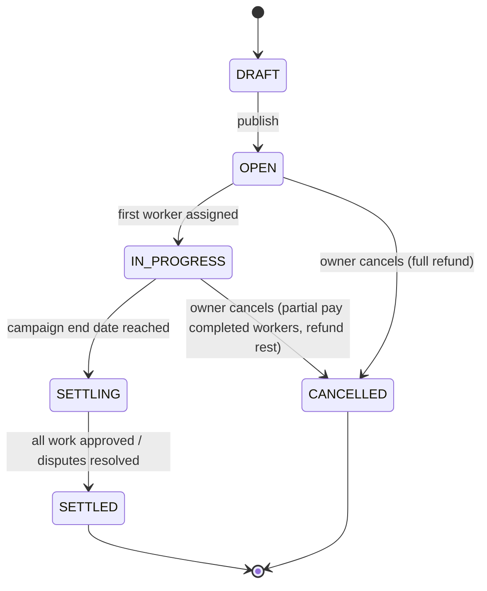
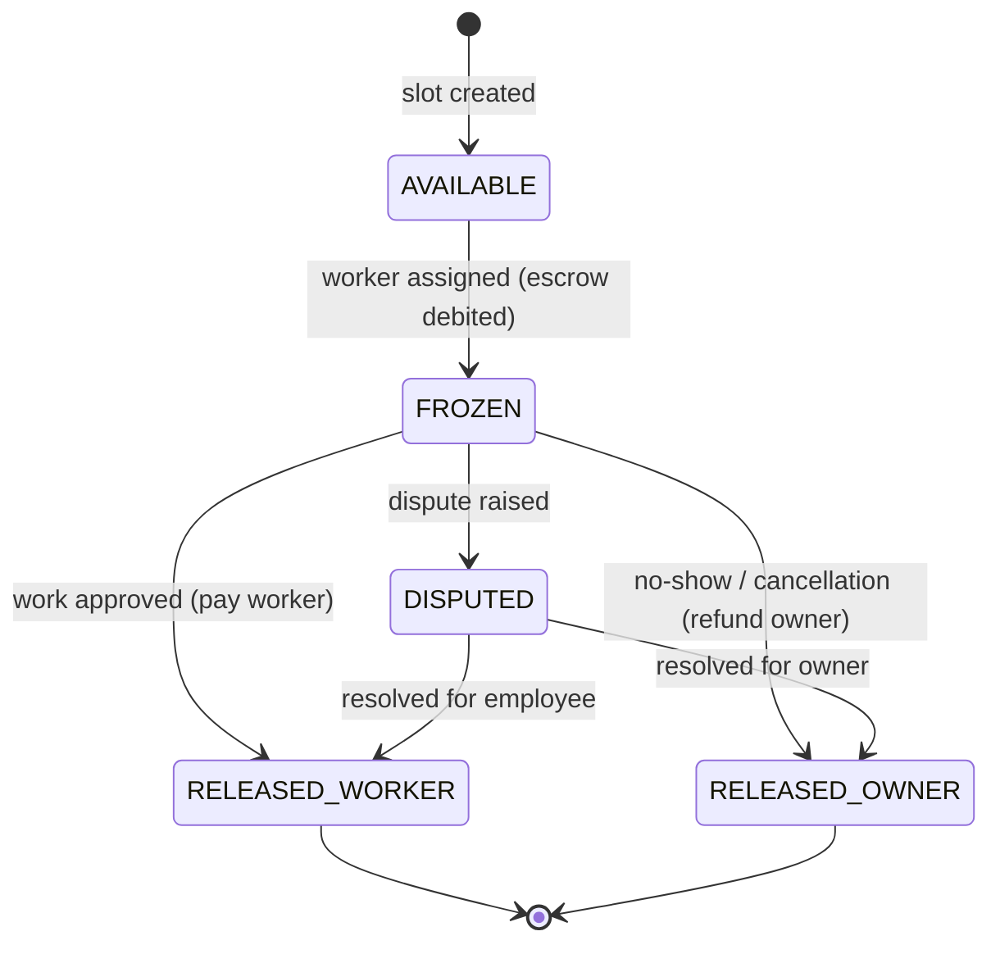
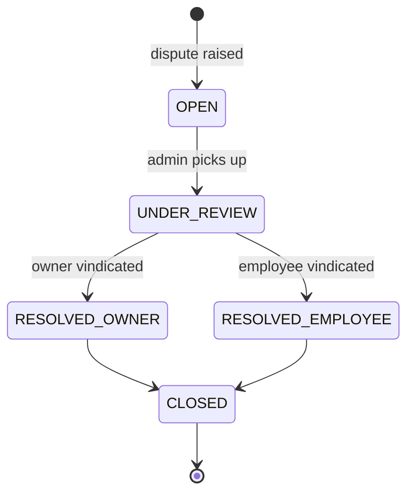
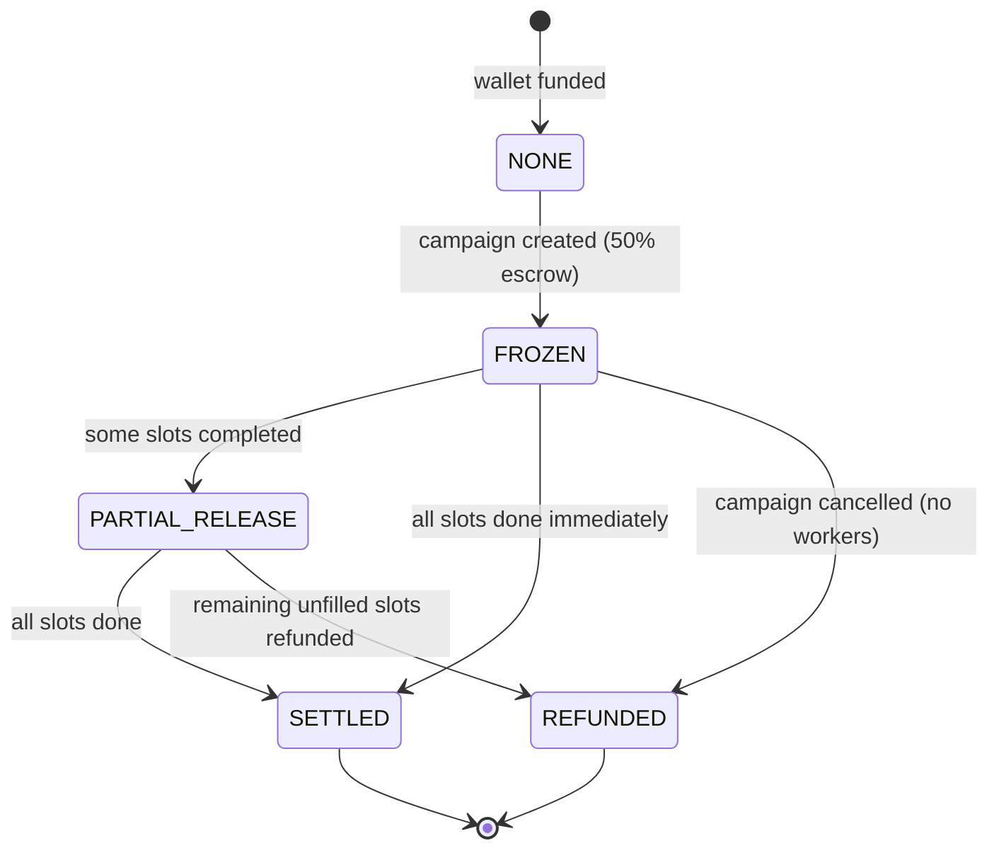

# KOINWORK BLUEPRINT
> **Single Source of Truth** — Consult this file before starting any task.

---

## Table of Contents
1. [Project Overview](#1-project-overview)
2. [Real-World Failure Analysis](#2-real-world-failure-analysis)
3. [Optimized Database Schema](#3-optimized-database-schema)
4. [Edge Functions (Server-Side Logic)](#4-edge-functions-server-side-logic)
5. [Optimized App Flow](#5-optimized-app-flow)
6. [Feed Algorithm v2](#6-feed-algorithm-v2)
7. [Security Hardened Architecture](#7-security-hardened-architecture)
8. [Scalability Plan](#8-scalability-plan)
9. [Development Phases (Updated)](#9-development-phases-updated)
10. [Checklist / Status Tracker](#10-checklist--status-tracker)
11. [Conventions & Rules](#11-conventions--rules)

---

## 1. Project Overview

### Platform Name
**KoinWork** (repository: `Worky`)

### Mission
A blue-collar gig economy platform connecting **Owners** (businesses/individuals who post jobs) with **Employees** (workers who browse, apply, work, and earn). The internal currency **KCoin** drives all transactions.

### KCoin Economy
| Unit | Value |
|------|-------|
| 1 KCoin | ₹10 |
| Minimum withdrawal | 50 KCoins (₹500) |
| Internal storage | **Paisa** (1 KCoin = 1000 paisa; ₹1 = 100 paisa) |

**Why paisa?** Floating-point arithmetic on `float` columns causes rounding drift over thousands of transactions. Integer paisa storage guarantees exact arithmetic.

### Tech Stack

| Layer | Technology | Notes |
|-------|-----------|-------|
| Web frontend | Next.js 14+ (App Router) | Responsive, SSR + RSC |
| Mobile frontend | React Native (Expo) | iOS + Android, cross-platform |
| Auth | Firebase Authentication | Email, Google OAuth, Phone OTP |
| Database | Firebase Firestore | NoSQL documents; integer paisa for money |
| Realtime | Firebase Realtime Database | Low-latency notifications, job feed |
| Storage | Firebase Storage | Avatars, KYC docs, work photos |
| Server-side logic | Firebase Cloud Functions (Node 20) | All financial ops server-only |
| Password hashing | Argon2 (via server functions) | For any additional credentials layer |
| Secrets management | HashiCorp Vault | API keys, private keys, payment secrets |
| Payments (primary) | Razorpay (India) | INR deposits, KCoin purchases |
| Payments (secondary) | Cashfree (India) | Payouts / bank withdrawals |
| Security / CDN | Cloudflare | DDoS, WAF, edge caching |
| Monitoring | AWS CloudWatch | Logs, metrics, alerts |
| Caching | Upstash Redis | Feed cache, session store |

> **⚠️ Migration note (2026-03):** Project migrated from Supabase → Firebase.
> All `supabase/migrations/` SQL files are archived; the canonical data layer is now Firestore (`firebase/rules/` + `firebase/indexes/`).

### User Roles

| Role | Capabilities |
|------|-------------|
| **Owner** | Create campaigns, fund escrow, approve work, manage workers, boost listings |
| **Employee** | Browse feed, apply to campaigns, check in/out, earn KCoins, withdraw to bank |

### Core Flow
```
Owner funds wallet → Creates campaign (escrow frozen) → Employee applies →
Owner approves → Employee checks in (geofenced) → Employee checks out →
Owner approves work → KCoins released to employee → Employee withdraws (KYC)
```

---

## 2. Real-World Failure Analysis

> This section documents every known failure mode and the production-grade fix for each. All fixes are reflected in the schema, edge functions, and app flow defined later.

---

### A. Wallet & KCoin Economy Failures

#### Failure 1 — Race Condition on Wallet Balance
**Scenario:** An owner with 100 KCoins simultaneously creates two 60-KCoin campaigns from two browser tabs.  
**Result:** Both reads return 100 KCoins (≥ 60), both debits succeed, balance goes to -20 KCoins.

```sql
-- BROKEN: two concurrent transactions both read balance = 10000000 paisa
SELECT available_balance FROM wallets WHERE user_id = $1; -- returns 10000000
UPDATE wallets SET available_balance = available_balance - 6000000 WHERE user_id = $1;
```

**Fix:** `SELECT ... FOR UPDATE` row-level lock inside a serializable transaction.

```sql
BEGIN;
SELECT available_balance FROM wallets WHERE user_id = $1 FOR UPDATE;
-- now other transactions block until this one commits
UPDATE wallets SET available_balance = available_balance - 6000000
WHERE user_id = $1 AND available_balance >= 6000000; -- guard check
COMMIT;
```

---

#### Failure 2 — Floating Point Rounding
**Scenario:** Storing KCoin balances as `float8`. After 10,000 micro-transactions, rounding errors accumulate.

```
1.1 + 2.2 = 3.3000000000000003  -- classic IEEE 754 drift
```

**Fix:** Store **all monetary values as integer paisa** (1 KCoin = 1,000 paisa; ₹1 = 100 paisa).

```typescript
// conversion helpers
const PAISA_PER_KCOIN = 1000;
const PAISA_PER_RUPEE = 100;

function kCoinsToPaisa(kcoins: number): number {
  return Math.round(kcoins * PAISA_PER_KCOIN); // integer, no drift
}

function paisaToKCoins(paisa: number): number {
  return paisa / PAISA_PER_KCOIN; // display only — always integer input
}
```

---

#### Failure 3 — Payment Gateway Webhook Retry Duplicates
**Scenario:** Razorpay fires a `payment.captured` webhook. The server is slow; Razorpay retries after 30 seconds. Both deliveries credit the wallet.

**Fix:** Idempotency keys on every transaction row.

```sql
INSERT INTO transactions (id, wallet_id, amount_paisa, type, idempotency_key, ...)
VALUES (gen_random_uuid(), $wallet_id, $amount, 'DEPOSIT', $razorpay_payment_id, ...)
ON CONFLICT (idempotency_key) DO NOTHING; -- safe retry
```

---

#### Failure 4 — Withdrawal Abuse (Spend After Withdraw Request)
**Scenario:** Employee requests withdrawal of 500 KCoins. Before it processes, they apply to a 300-KCoin campaign. Both succeed → negative balance.

**Fix:** Immediately freeze the withdrawal amount on request.

```sql
BEGIN;
UPDATE wallets
SET available_balance = available_balance - $amount,
    frozen_balance    = frozen_balance    + $amount
WHERE user_id = $1 AND available_balance >= $amount
RETURNING id;
-- if no row returned, raise error
INSERT INTO withdrawals (wallet_id, amount_paisa, status) VALUES ($wallet_id, $amount, 'PENDING');
COMMIT;
```

---

### B. Campaign Escrow System Failures

#### Failure 1 — Partial Worker Fill (Stuck Escrow)
**Scenario:** Campaign has 10 slots, budget 10,000 KCoins total. Only 3 workers apply and complete. The remaining 7,000 KCoins stay frozen forever.

**Fix:** Per-slot escrow instead of per-campaign lump-sum. Release unfilled slots on campaign close.

```
BEFORE: Freeze 10,000 KCoins for entire campaign upfront
AFTER:  Freeze 1,000 KCoins per slot only when a worker is ASSIGNED
        Release slot escrow immediately if worker cancels or no-shows
```

---

#### Failure 2 — Mid-Campaign Cancellation (No Defined Behavior)
**Scenario:** Owner cancels a 10-slot campaign after 4 workers have already worked.

**Fix:** Clear state machine + settlement edge function.



---

#### Failure 3 — Worker No-Show (Ghost Slot)
**Scenario:** Worker is accepted, slot is marked ASSIGNED, but worker never checks in. Slot is consumed, escrow frozen for ghost worker indefinitely.

**Fix:** 48-hour auto-release cron job.

```typescript
// runs every hour via cron
async function autoReleaseEscrow() {
  const noShows = await supabase
    .from('campaign_slots')
    .select('*')
    .eq('status', 'ASSIGNED')
    .lt('assigned_at', new Date(Date.now() - 48 * 60 * 60 * 1000).toISOString());

  for (const slot of noShows.data) {
    await releaseSlotEscrow(slot.id, 'NO_SHOW');
  }
}
```

---

#### Failure 4 — Escrow Refund Timing
**Scenario:** Campaign closes with 1 out of 10 workers. What fraction gets refunded and when?

**Fix:** Escrow state machine per slot.



---

### C. Location-Based Feed Performance

#### Failure 1 — No Spatial Indexing
**Scenario:** `SELECT * FROM campaigns WHERE ST_DWithin(location, $userLoc, 10000)` runs a full table scan on 1M rows. Every feed load takes 3–8 seconds.

**Fix:** PostGIS GiST index.

```sql
CREATE EXTENSION IF NOT EXISTS postgis;
CREATE INDEX idx_campaigns_location ON campaigns USING GIST (location);
-- now distance queries use index scan, not full table scan
```

---

#### Failure 2 — No Feed Caching
**Scenario:** 10,000 concurrent users all trigger the same expensive ST_DWithin + ranking query.

**Fix:** Materialized view per city, refreshed every 5 minutes.

```sql
CREATE MATERIALIZED VIEW feed_cache_mumbai AS
SELECT c.*, ST_Distance(c.location, ST_MakePoint(72.8777, 19.0760)::geography) AS distance_m
FROM campaigns c
WHERE c.status = 'OPEN'
  AND ST_DWithin(c.location, ST_MakePoint(72.8777, 19.0760)::geography, 50000)
ORDER BY feed_score DESC;

-- refresh via cron
REFRESH MATERIALIZED VIEW CONCURRENTLY feed_cache_mumbai;
```

---

#### Failure 3 — Stale Location Data
**Scenario:** User moved from Mumbai to Delhi 6 months ago. Profile location still shows Mumbai. Feed shows Mumbai jobs.

**Fix:** Periodic location prompt if location not updated in 30 days.

```typescript
const daysSinceUpdate = differenceInDays(new Date(), profile.location_updated_at);
if (daysSinceUpdate > 30) {
  showLocationRefreshPrompt();
}
```

---

### D. Check-in/Check-out Gaming

#### Failure 1 — No Location Verification
**Scenario:** Employee checks in from their home 10 km away from the job site.

**Fix:** Geofenced check-in (must be within 200 m of job site).

```typescript
const distanceMeters = geoDistance(userLat, userLng, jobLat, jobLng);
if (distanceMeters > 200) {
  throw new Error(`Must be within 200m of job site. You are ${distanceMeters.toFixed(0)}m away.`);
}
```

---

#### Failure 2 — No Time Validation
**Scenario:** Check in at 11:59 PM, check out at 12:01 AM = recorded as 2-day shift.

**Fix:** Store UTC timestamps, calculate duration server-side, enforce minimum 4-hour and maximum 16-hour shift.

```sql
CHECK (checkout_time > checkin_time),
CHECK (EXTRACT(EPOCH FROM (checkout_time - checkin_time)) / 3600 >= 4),   -- min 4h
CHECK (EXTRACT(EPOCH FROM (checkout_time - checkin_time)) / 3600 <= 16)   -- max 16h
```

---

#### Failure 3 — Manual Approval Bottleneck
**Scenario:** Campaign has 50 workers × 30 days = 1,500 approval decisions for the owner.

**Fix:** Batch approval UI with anomaly flagging. Auto-approve normal check-ins; flag anomalies for manual review.

```typescript
interface WorkLogFlags {
  distance_anomaly: boolean;    // > 200m from site
  duration_anomaly: boolean;    // < 4h or > 12h
  time_anomaly: boolean;        // outside scheduled hours
  location_jump: boolean;       // impossible travel speed
}
// Only flagged logs need manual review; clean logs auto-approved
```

---

### E. Realtime Subscription Scaling

#### Failure 1 — Per-Campaign Channels Hit Supabase Limits
**Scenario:** 100,000 active campaigns → 100,000 Realtime channels. Supabase default limit is far lower.

**Fix:** Aggregate channels by city/region.

```typescript
// BEFORE (broken): one channel per campaign
supabase.channel(`campaign:${campaignId}`)

// AFTER (fixed): one channel per city
supabase.channel(`city:${cityId}:feed`)
```

---

#### Failure 2 — Zombie Subscriptions
**Scenario:** User closes the app without the cleanup handler running. Subscription stays open, consuming server resources.

**Fix:** Heartbeat-based cleanup. If no heartbeat in 5 minutes, server-side cleanup releases the subscription.

```typescript
// client: send heartbeat every 60s
const heartbeat = setInterval(() => {
  channel.send({ type: 'broadcast', event: 'heartbeat', payload: { ts: Date.now() } });
}, 60_000);

// on unmount
clearInterval(heartbeat);
supabase.removeChannel(channel);
```

---

### F. Security Gaps

#### Failure 1 — Client-Side KCoin Calculations
**Scenario:** Client sends `{ amount: 99999 }` in a work approval request. Server trusts it.

**Fix:** ALL financial calculations server-side only, inside Edge Functions. Client provides intent only (`approve_work_log_id`), server calculates amount from DB.

---

#### Failure 2 — No Rate Limiting on Applications
**Scenario:** Bot creates 10,000 applications to drain campaigns or game the rating system.

**Fix:** Rate limit: 10 applications per hour per user, enforced in Edge Function + Upstash Redis.

```typescript
const key = `ratelimit:apply:${userId}`;
const count = await redis.incr(key);
if (count === 1) await redis.expire(key, 3600); // 1-hour window
if (count > 10) throw new Error('Rate limit exceeded: max 10 applications per hour');
```

---

#### Failure 3 — Fraud (Fake Owner + Fake Employee = Free Money)
**Scenario:** Attacker creates fake owner account, fake employee account. Fake campaign, fake work, withdrawal. Net ₹ out.

**Fix:** Fraud scoring system. New accounts + fast withdrawal pattern triggers hold.

| Signal | Score |
|--------|-------|
| Account age < 7 days | +30 |
| No KYC completed | +25 |
| First withdrawal within 48h of first earning | +20 |
| >3 applications in first hour | +15 |
| Score ≥ 50 | Auto-hold + manual review |

---

#### Failure 4 — Missing RLS Policies
**Fix:** Complete RLS policies for every table (see Section 7 for full SQL).

---

### G. Missing Critical Features

| Missing Feature | Risk Level | Planned Phase |
|----------------|-----------|---------------|
| Dispute resolution UI/workflow | High | Phase 7 |
| KYC / identity verification | Critical (regulatory) | Phase 4 |
| TDS for payments > ₹30K/year (Indian law) | Critical (legal) | Phase 4 |
| Multi-language (Hindi, regional languages) | High (UX) | Phase 6 |
| Offline mode (poor connectivity at job sites) | High (UX) | Phase 6 |
| Campaign templates (repeat job creation) | Medium | Phase 5 |
| Worker rating decay (old 5-star ≠ current) | Medium | Phase 5 |
| Surge / demand pricing suggestions | Low | Phase 7 |

---

## 3. Optimized Database Schema (Firestore)

> **Migrated from PostgreSQL/PostGIS to Firebase Firestore.**
> All monetary values are stored as integer **paisa** (never float).
> 1 KCoin = 1000 paisa | ₹1 = 100 paisa | 1 KCoin = ₹10
>
> Security rules live in `firebase/rules/firestore.rules`.
> Composite indexes live in `firebase/indexes/firestore.indexes.json`.

### Collection: `profiles`

```typescript
// Document ID = Firebase Auth UID
interface ProfileDoc {
  role:                'owner' | 'employee';
  full_name:           string;
  phone:               string | null;
  avatar_url:          string | null;
  bio:                 string | null;
  lat:                 number | null;   // decimal degrees
  lng:                 number | null;
  city:                string | null;
  state:               string | null;
  location_updated_at: Timestamp;
  kyc_status:          'NOT_SUBMITTED' | 'PENDING' | 'APPROVED' | 'REJECTED';
  kyc_verified_at:     Timestamp | null;
  avg_rating:          number;          // 0–5, denormalised
  total_reviews:       number;
  is_active:           boolean;
  created_at:          Timestamp;
  updated_at:          Timestamp;
}
```

### Collection: `wallets`

```typescript
// Document ID = "wallet_{uid}"
// ⚠️  CLIENT WRITES FORBIDDEN — use Cloud Functions only
interface WalletDoc {
  user_id:           string;   // Firebase Auth UID
  available_balance: number;   // integer paisa — NEVER float
  frozen_balance:    number;   // paisa frozen for escrow / pending withdrawal
  lifetime_earned:   number;   // paisa total ever credited
  lifetime_spent:    number;   // paisa total ever debited
  created_at:        Timestamp;
  updated_at:        Timestamp;
}
```

### Collection: `transactions`

```typescript
// Document ID = auto-generated
// ⚠️  CLIENT WRITES FORBIDDEN — use Cloud Functions only
interface TransactionDoc {
  wallet_id:        string;
  amount_paisa:     number;   // positive = credit, negative = debit (integer)
  type:             'DEPOSIT' | 'ESCROW_FREEZE' | 'ESCROW_RELEASE' | 'PAYMENT'
                  | 'WITHDRAWAL' | 'REFUND' | 'BOOST_FEE';
  status:           'PENDING' | 'COMPLETED' | 'FAILED' | 'REVERSED';
  idempotency_key:  string;   // UNIQUE — prevents duplicate webhook credits
  reference_id:     string | null;
  reference_type:   string | null;  // e.g. "campaign", "work_log"
  description:      string | null;
  metadata:         Record<string, unknown>;
  created_at:       Timestamp;
  updated_at:       Timestamp;
}
```

> **Idempotency:** Before inserting any transaction, the Cloud Function queries
> `WHERE idempotency_key == key LIMIT 1`. If a doc already exists, the operation
> is a no-op and the existing result is returned. This prevents Razorpay/Cashfree
> webhook retries from double-crediting wallets.

### Collection: `campaigns`

```typescript
interface CampaignDoc {
  owner_id:            string;
  title:               string;
  description:         string;
  instructions:        string;
  category:            string;
  lat:                 number;
  lng:                 number;
  city:                string;
  state:               string;
  geohash:             string;  // for proximity queries without PostGIS
  max_workers:         number;
  pay_per_day_rupees:  number;
  duration_days:       number;
  start_date:          Timestamp;
  status:              'DRAFT' | 'OPEN' | 'IN_PROGRESS' | 'SETTLING' | 'SETTLED' | 'CANCELLED';
  escrow_status:       'NONE' | 'FROZEN' | 'PARTIAL_RELEASE' | 'SETTLED' | 'REFUNDED';
  escrow_amount_paisa: number;   // total frozen at creation
  total_slots_filled:  number;
  boost_tier:          'NONE' | 'BASIC' | 'STANDARD' | 'PREMIUM';
  boost_expires_at:    Timestamp | null;
  created_at:          Timestamp;
  updated_at:          Timestamp;
}
```

> **Proximity queries:** Use the `geofire-common` library to encode lat/lng as a
> geohash string. Query `WHERE geohash >= lower AND geohash <= upper` to find
> campaigns within a radius. This replaces PostGIS `ST_DWithin`.

### Collection: `campaign_slots`

```typescript
// One document per worker slot — enables per-slot escrow tracking
interface CampaignSlotDoc {
  campaign_id:    string;
  employee_id:    string | null;
  escrow_paisa:   number;        // frozen per slot (pay_per_day × duration)
  status:         'AVAILABLE' | 'APPLIED' | 'ASSIGNED' | 'COMPLETED'
                | 'NO_SHOW' | 'DISPUTED' | 'CANCELLED';
  assigned_at:    Timestamp | null;
  completed_at:   Timestamp | null;
  created_at:     Timestamp;
  updated_at:     Timestamp;
}
```

### Collection: `applications`

```typescript
interface ApplicationDoc {
  campaign_id:  string;
  employee_id:  string;
  slot_id:      string | null;
  status:       'PENDING' | 'ACCEPTED' | 'REJECTED' | 'WITHDRAWN';
  cover_note:   string | null;
  created_at:   Timestamp;
  updated_at:   Timestamp;
}
```

> **Rate limit index:** `(employee_id ASC, created_at DESC)` — Cloud Function
> queries last hour's count before allowing a new application. Limit: 10/hour.

### Collection: `work_logs`

```typescript
interface WorkLogDoc {
  campaign_id:               string;
  employee_id:               string;
  work_date:                 string;       // "YYYY-MM-DD"
  checkin_at:                Timestamp | null;
  checkin_lat:               number | null;
  checkin_lng:               number | null;
  checkin_distance_meters:   number | null; // distance from job site at check-in
  checkout_at:               Timestamp | null;
  shift_duration_minutes:    number | null;
  status:                    'PENDING' | 'APPROVED' | 'DISPUTED' | 'AUTO_APPROVED';
  approved_at:               Timestamp | null;
  created_at:                Timestamp;
  updated_at:                Timestamp;
}
```

> **Geofence check-in:** Must be within 200m of job site.
> **Shift validation:** Minimum 4h, maximum 16h.

### Collection: `withdrawals`

```typescript
interface WithdrawalDoc {
  user_id:         string;
  amount_paisa:    number;
  status:          'PENDING' | 'PROCESSING' | 'COMPLETED' | 'FAILED' | 'CANCELLED';
  bank_details:    { upi?: string; account_no?: string; ifsc?: string };
  idempotency_key: string;
  tds_paisa:       number;   // TDS deducted (10% on amounts crossing ₹30K/year)
  razorpay_payout_id: string | null;
  created_at:      Timestamp;
  updated_at:      Timestamp;
}
```

### Collection: `disputes`

```typescript
interface DisputeDoc {
  campaign_id:  string;
  work_log_id:  string | null;
  raised_by:    string;   // uid
  against:      string;   // uid
  description:  string;
  evidence_urls: string[];
  status:       'OPEN' | 'UNDER_REVIEW' | 'RESOLVED_OWNER' | 'RESOLVED_EMPLOYEE' | 'CLOSED';
  resolution_note: string | null;
  resolved_at:  Timestamp | null;
  created_at:   Timestamp;
  updated_at:   Timestamp;
}
```



### Collection: `notifications`

```typescript
interface NotificationDoc {
  user_id:   string;
  type:      'APPLICATION_RECEIVED' | 'APPLICATION_ACCEPTED' | 'APPLICATION_REJECTED'
           | 'WORK_APPROVED' | 'PAYMENT_RECEIVED' | 'WITHDRAWAL_PROCESSED'
           | 'DISPUTE_UPDATE' | 'CAMPAIGN_UPDATE' | 'SYSTEM';
  title:     string;
  body:      string;
  read:      boolean;
  data:      Record<string, string>;  // deep link payload
  created_at: Timestamp;
}
```

### Collection: `fraud_flags`

```typescript
interface FraudFlagDoc {
  user_id:      string;
  score:        number;   // ≥50 = auto-hold
  signals:      { reason: string; score: number }[];
  status:       'PENDING_REVIEW' | 'CLEARED' | 'CONFIRMED_FRAUD';
  created_at:   Timestamp;
  updated_at:   Timestamp;
}
```

### Escrow State Machine



---


## 4. Edge Functions (Server-Side Logic)

> All financial calculations are **server-side only**. Clients send intent (IDs), not amounts.

### 4.1 `create-campaign`

```typescript
// supabase/functions/create-campaign/index.ts
import { createClient } from '@supabase/supabase-js';

const supabase = createClient(
  Deno.env.get('SUPABASE_URL')!,
  Deno.env.get('SUPABASE_SERVICE_ROLE_KEY')!
);

export default async function handler(req: Request): Promise<Response> {
  const { owner_id, title, description, category, pay_per_slot_paisa,
          total_slots, location, address, city, state,
          start_date, end_date, shift_start_time, shift_end_time } = await req.json();

  // 1. Validate required escrow = pay_per_slot * total_slots
  const requiredEscrowPaisa = pay_per_slot_paisa * total_slots;

  // 2. Begin atomic transaction
  const { data, error } = await supabase.rpc('create_campaign_atomic', {
    p_owner_id:            owner_id,
    p_title:               title,
    p_description:         description,
    p_category:            category,
    p_pay_per_slot_paisa:  pay_per_slot_paisa,
    p_total_slots:         total_slots,
    p_location_lng:        location.lng,
    p_location_lat:        location.lat,
    p_address:             address,
    p_city:                city,
    p_state:               state,
    p_start_date:          start_date,
    p_end_date:            end_date,
    p_shift_start_time:    shift_start_time,
    p_shift_end_time:      shift_end_time,
    p_required_escrow:     requiredEscrowPaisa,
    p_idempotency_key:     `create-campaign:${owner_id}:${title}:${start_date}`,
  });

  if (error) {
    return new Response(JSON.stringify({ error: error.message }), { status: 400 });
  }

  return new Response(JSON.stringify({ campaign: data }), { status: 201 });
}
```

```sql
-- Atomic PL/pgSQL function called by the Edge Function
CREATE OR REPLACE FUNCTION create_campaign_atomic(
  p_owner_id UUID, p_title TEXT, p_description TEXT, p_category TEXT,
  p_pay_per_slot_paisa BIGINT, p_total_slots INT,
  p_location_lng DOUBLE PRECISION, p_location_lat DOUBLE PRECISION,
  p_address TEXT, p_city TEXT, p_state TEXT,
  p_start_date DATE, p_end_date DATE,
  p_shift_start_time TIME, p_shift_end_time TIME,
  p_required_escrow BIGINT, p_idempotency_key TEXT
) RETURNS JSONB LANGUAGE plpgsql SECURITY DEFINER AS $$
DECLARE
  v_wallet wallets%ROWTYPE;
  v_campaign_id UUID;
  v_transaction_id UUID;
BEGIN
  -- Lock wallet row to prevent race condition
  SELECT * INTO v_wallet FROM wallets WHERE user_id = p_owner_id FOR UPDATE;

  IF v_wallet.available_balance < p_required_escrow THEN
    RAISE EXCEPTION 'Insufficient balance. Required: %, Available: %',
      p_required_escrow, v_wallet.available_balance;
  END IF;

  -- Create campaign
  INSERT INTO campaigns (
    owner_id, title, description, category, pay_per_slot_paisa,
    total_slots, location, address, city, state,
    start_date, end_date, shift_start_time, shift_end_time,
    status, escrow_status
  ) VALUES (
    p_owner_id, p_title, p_description, p_category, p_pay_per_slot_paisa,
    p_total_slots,
    ST_MakePoint(p_location_lng, p_location_lat)::geography,
    p_address, p_city, p_state,
    p_start_date, p_end_date, p_shift_start_time, p_shift_end_time,
    'OPEN', 'FROZEN'
  ) RETURNING id INTO v_campaign_id;

  -- Create campaign slots
  INSERT INTO campaign_slots (campaign_id, escrow_amount_paisa)
  SELECT v_campaign_id, p_pay_per_slot_paisa
  FROM generate_series(1, p_total_slots);

  -- Record transaction
  INSERT INTO transactions (
    wallet_id, amount_paisa, type, status, idempotency_key,
    reference_id, reference_type, description
  ) VALUES (
    v_wallet.id, -p_required_escrow, 'ESCROW_FREEZE', 'COMPLETED',
    p_idempotency_key, v_campaign_id, 'campaign',
    'Escrow freeze for campaign: ' || p_title
  ) RETURNING id INTO v_transaction_id;

  -- Debit wallet
  UPDATE wallets
  SET available_balance = available_balance - p_required_escrow,
      frozen_balance    = frozen_balance    + p_required_escrow,
      lifetime_spent    = lifetime_spent    + p_required_escrow
  WHERE id = v_wallet.id;

  RETURN jsonb_build_object('campaign_id', v_campaign_id, 'transaction_id', v_transaction_id);
END;
$$;
```

---

### 4.2 `apply-to-campaign`

```typescript
// supabase/functions/apply-to-campaign/index.ts
import { Redis } from '@upstash/redis';

const redis = new Redis({
  url: Deno.env.get('UPSTASH_REDIS_URL')!,
  token: Deno.env.get('UPSTASH_REDIS_TOKEN')!,
});

export default async function handler(req: Request): Promise<Response> {
  const { employee_id, campaign_id, cover_note } = await req.json();

  // 1. Rate limiting: max 10 applications per hour
  const rateLimitKey = `ratelimit:apply:${employee_id}`;
  const count = await redis.incr(rateLimitKey);
  if (count === 1) await redis.expire(rateLimitKey, 3600);
  if (count > 10) {
    return new Response(
      JSON.stringify({ error: 'Rate limit: max 10 applications per hour' }),
      { status: 429 }
    );
  }

  // 2. Check for duplicate application
  const { data: existing } = await supabase
    .from('applications')
    .select('id')
    .eq('campaign_id', campaign_id)
    .eq('employee_id', employee_id)
    .single();

  if (existing) {
    return new Response(
      JSON.stringify({ error: 'Already applied to this campaign' }),
      { status: 409 }
    );
  }

  // 3. Check slot availability
  const { data: campaign } = await supabase
    .from('campaigns')
    .select('total_slots, filled_slots, status')
    .eq('id', campaign_id)
    .single();

  if (!campaign || campaign.status !== 'OPEN') {
    return new Response(JSON.stringify({ error: 'Campaign not available' }), { status: 400 });
  }

  if (campaign.filled_slots >= campaign.total_slots) {
    return new Response(JSON.stringify({ error: 'No slots available' }), { status: 400 });
  }

  // 4. Create application
  const { data: application, error } = await supabase
    .from('applications')
    .insert({ campaign_id, employee_id, cover_note, status: 'PENDING' })
    .select()
    .single();

  if (error) {
    return new Response(JSON.stringify({ error: error.message }), { status: 400 });
  }

  // 5. Notify owner
  await notifyOwner(campaign_id, employee_id);

  return new Response(JSON.stringify({ application }), { status: 201 });
}
```

---

### 4.3 `approve-work`

```typescript
// supabase/functions/approve-work/index.ts
export default async function handler(req: Request): Promise<Response> {
  const { work_log_id, owner_id, approved } = await req.json();

  // 1. Fetch work log (server computes amount — never trust client)
  const { data: workLog } = await supabase
    .from('work_logs')
    .select('*, campaign_slots(escrow_amount_paisa, campaign_id), campaigns(owner_id)')
    .eq('id', work_log_id)
    .single();

  if (!workLog) {
    return new Response(JSON.stringify({ error: 'Work log not found' }), { status: 404 });
  }

  // 2. Verify owner owns the campaign
  if (workLog.campaigns.owner_id !== owner_id) {
    return new Response(JSON.stringify({ error: 'Unauthorized' }), { status: 403 });
  }

  // 3. Geofence re-validation (server-side)
  if (workLog.checkin_distance_meters > 200) {
    return new Response(
      JSON.stringify({ error: 'Check-in location outside geofence' }),
      { status: 400 }
    );
  }

  // 4. Minimum shift check (server-side)
  if (workLog.shift_duration_minutes < 240) { // 4 hours
    return new Response(
      JSON.stringify({ error: 'Shift too short (minimum 4 hours)' }),
      { status: 400 }
    );
  }

  if (!approved) {
    // Owner rejected — release escrow back to owner
    await releaseEscrowToOwner(workLog.campaign_slots.id, 'OWNER_REJECTED', work_log_id);
    return new Response(JSON.stringify({ status: 'rejected' }), { status: 200 });
  }

  // 5. Atomic: release escrow → credit employee wallet
  const amountPaisa = workLog.campaign_slots.escrow_amount_paisa;
  const idempotencyKey = `approve-work:${work_log_id}`;

  const { error } = await supabase.rpc('approve_work_atomic', {
    p_work_log_id:      work_log_id,
    p_slot_id:          workLog.campaign_slots.id,
    p_employee_id:      workLog.employee_id,
    p_amount_paisa:     amountPaisa,
    p_idempotency_key:  idempotencyKey,
  });

  if (error) {
    return new Response(JSON.stringify({ error: error.message }), { status: 500 });
  }

  return new Response(JSON.stringify({ status: 'approved', amount_paisa: amountPaisa }), {
    status: 200,
  });
}
```

---

### 4.4 `process-withdrawal`

```typescript
// supabase/functions/process-withdrawal/index.ts
export default async function handler(req: Request): Promise<Response> {
  const { user_id, amount_paisa, bank_account_number, bank_ifsc, bank_account_name } =
    await req.json();

  // 1. KYC check (mandatory before withdrawal)
  const { data: profile } = await supabase
    .from('profiles')
    .select('kyc_status')
    .eq('id', user_id)
    .single();

  if (profile?.kyc_status !== 'APPROVED') {
    return new Response(
      JSON.stringify({ error: 'KYC verification required before withdrawal' }),
      { status: 403 }
    );
  }

  // 2. Fraud score check
  const fraudScore = await computeFraudScore(user_id);
  if (fraudScore >= 50) {
    await flagForReview(user_id, fraudScore);
    return new Response(
      JSON.stringify({ error: 'Withdrawal under review. Support will contact you.' }),
      { status: 202 }
    );
  }

  // 3. TDS calculation (₹30,000/year = 3,000,000 paisa threshold)
  const yearlyEarningsPaisa = await getYearlyEarnings(user_id);
  const TDS_THRESHOLD_PAISA = 3_000_000; // ₹30,000
  const TDS_RATE = 0.10; // 10%
  let tdsDeductedPaisa = 0;
  if (yearlyEarningsPaisa + amount_paisa > TDS_THRESHOLD_PAISA) {
    const taxableAmount = Math.max(0, yearlyEarningsPaisa + amount_paisa - TDS_THRESHOLD_PAISA);
    tdsDeductedPaisa = Math.round(taxableAmount * TDS_RATE);
  }

  const netAmountPaisa = amount_paisa - tdsDeductedPaisa;

  // 4. Create withdrawal record (trigger auto-freezes wallet balance)
  const { data: withdrawal, error } = await supabase
    .from('withdrawals')
    .insert({
      user_id,
      wallet_id: await getWalletId(user_id),
      amount_paisa,
      bank_account_number,
      bank_ifsc,
      bank_account_name,
      kyc_status_at_request: profile.kyc_status,
      tds_deducted_paisa: tdsDeductedPaisa,
      status: 'PENDING',
    })
    .select()
    .single();

  if (error) {
    return new Response(JSON.stringify({ error: error.message }), { status: 400 });
  }

  // 5. Initiate Razorpay payout
  const payout = await razorpay.payouts.create({
    account_number: Deno.env.get('RAZORPAY_ACCOUNT_NUMBER'),
    fund_account: { account_type: 'bank_account', bank_account: { name: bank_account_name, ifsc: bank_ifsc, account_number: bank_account_number } },
    amount: netAmountPaisa,  // Razorpay uses paisa
    currency: 'INR',
    mode: 'IMPS',
    purpose: 'payout',
    reference_id: withdrawal.id,
  });

  // 6. Update withdrawal with payout ID
  await supabase
    .from('withdrawals')
    .update({ razorpay_payout_id: payout.id, status: 'PROCESSING' })
    .eq('id', withdrawal.id);

  return new Response(
    JSON.stringify({ withdrawal_id: withdrawal.id, net_amount_paisa: netAmountPaisa, tds_paisa: tdsDeductedPaisa }),
    { status: 200 }
  );
}
```

---

### 4.5 `boost-campaign`

```typescript
// supabase/functions/boost-campaign/index.ts
const BOOST_TIERS = {
  BASIC:    { cost_paisa: 500_000, duration_hours: 24,  multiplier: 1.5 },  // ₹50
  STANDARD: { cost_paisa: 1_500_000, duration_hours: 72, multiplier: 2.5 }, // ₹150
  PREMIUM:  { cost_paisa: 3_000_000, duration_hours: 168, multiplier: 4.0 },// ₹300
};

export default async function handler(req: Request): Promise<Response> {
  const { campaign_id, owner_id, tier } = await req.json();

  if (!BOOST_TIERS[tier]) {
    return new Response(JSON.stringify({ error: 'Invalid boost tier' }), { status: 400 });
  }

  const { cost_paisa, duration_hours } = BOOST_TIERS[tier];
  const idempotencyKey = `boost:${campaign_id}:${tier}:${Date.now()}`;

  const { error } = await supabase.rpc('boost_campaign_atomic', {
    p_campaign_id:     campaign_id,
    p_owner_id:        owner_id,
    p_tier:            tier,
    p_cost_paisa:      cost_paisa,
    p_duration_hours:  duration_hours,
    p_idempotency_key: idempotencyKey,
  });

  if (error) {
    return new Response(JSON.stringify({ error: error.message }), { status: 400 });
  }

  return new Response(
    JSON.stringify({ success: true, expires_in_hours: duration_hours }),
    { status: 200 }
  );
}
```

---

### 4.6 `fraud-check`

```typescript
// supabase/functions/fraud-check/index.ts
interface FraudSignals {
  account_age_days: number;
  kyc_completed: boolean;
  hours_since_first_earning: number;
  applications_in_first_hour: number;
  withdrawal_velocity: number; // withdrawals in last 7 days
}

async function computeFraudScore(userId: string): Promise<number> {
  const signals = await gatherFraudSignals(userId);
  let score = 0;

  if (signals.account_age_days < 7)               score += 30;
  if (!signals.kyc_completed)                      score += 25;
  if (signals.hours_since_first_earning < 48)      score += 20;
  if (signals.applications_in_first_hour > 3)      score += 15;
  if (signals.withdrawal_velocity > 3)             score += 10;

  if (score >= 50) {
    await supabase.from('fraud_flags').insert({
      user_id: userId,
      score,
      signals,
    });
  }

  return score;
}

async function gatherFraudSignals(userId: string): Promise<FraudSignals> {
  const { data: profile } = await supabase
    .from('profiles')
    .select('created_at, kyc_status')
    .eq('id', userId)
    .single();

  const accountAgeDays = differenceInDays(new Date(), new Date(profile.created_at));

  const { count: recentWithdrawals } = await supabase
    .from('withdrawals')
    .select('*', { count: 'exact', head: true })
    .eq('user_id', userId)
    .gte('created_at', new Date(Date.now() - 7 * 24 * 60 * 60 * 1000).toISOString());

  return {
    account_age_days:            accountAgeDays,
    kyc_completed:               profile.kyc_status === 'APPROVED',
    hours_since_first_earning:   await getHoursSinceFirstEarning(userId),
    applications_in_first_hour:  await getApplicationsInFirstHour(userId),
    withdrawal_velocity:         recentWithdrawals ?? 0,
  };
}
```

---

### 4.7 `settle-campaign`

```typescript
// supabase/functions/settle-campaign/index.ts
export default async function handler(req: Request): Promise<Response> {
  const { campaign_id } = await req.json();

  // 1. Fetch all slots
  const { data: slots } = await supabase
    .from('campaign_slots')
    .select('*')
    .eq('campaign_id', campaign_id);

  for (const slot of slots) {
    switch (slot.status) {
      case 'COMPLETED':
        // escrow already released to employee on work approval — no action
        break;
      case 'ASSIGNED':
      case 'APPLIED':
        // unfilled or pending slots — refund escrow to owner
        await releaseEscrowToOwner(slot.id, 'CAMPAIGN_SETTLED', campaign_id);
        break;
      case 'DISPUTED':
        // skip — handled separately by admin dispute resolution
        break;
    }
  }

  // 2. Update campaign status
  await supabase
    .from('campaigns')
    .update({ status: 'SETTLED', escrow_status: 'SETTLED' })
    .eq('id', campaign_id);

  return new Response(JSON.stringify({ status: 'settled' }), { status: 200 });
}
```

---

### 4.8 `auto-release-escrow` (Cron Job)

```typescript
// supabase/functions/auto-release-escrow/index.ts
// Triggered by Supabase Cron: every hour
export default async function handler(_req: Request): Promise<Response> {
  const threshold = new Date(Date.now() - 48 * 60 * 60 * 1000).toISOString();

  // Find all ASSIGNED slots where worker hasn't checked in within 48 hours
  const { data: noShowSlots } = await supabase
    .from('campaign_slots')
    .select('id, campaign_id, employee_id, escrow_amount_paisa')
    .eq('status', 'ASSIGNED')
    .lt('assigned_at', threshold);

  let releasedCount = 0;

  for (const slot of noShowSlots ?? []) {
    await releaseEscrowToOwner(slot.id, 'NO_SHOW_AUTO_RELEASE', slot.campaign_id);

    // Notify employee of slot release
    await supabase.from('notifications').insert({
      user_id: slot.employee_id,
      type:    'CAMPAIGN_UPDATE',
      title:   'Slot Released',
      body:    'Your assigned slot was released due to no check-in within 48 hours.',
      data:    { campaign_id: slot.campaign_id, slot_id: slot.id },
    });

    releasedCount++;
  }

  return new Response(JSON.stringify({ released_slots: releasedCount }), { status: 200 });
}
```

---

## 5. Optimized App Flow

### Employee Flow

```
Home Feed
  └─ Geo-indexed campaigns (PostGIS + cache)
  └─ Filter: category, distance, pay, date
  └─ Location staleness prompt (if > 30 days since update)
        ↓
Campaign Detail
  └─ Description, pay, dates, reviews (with decay weighting)
  └─ Map with job site marker
  └─ Owner rating & past campaign info
        ↓
Apply (Rate-Limited)
  └─ Cover note (optional)
  └─ Rate limit: 10 applications/hour enforced server-side
  └─ Duplicate check (1 application per campaign)
        ↓
Application Status
  └─ PENDING → ACCEPTED → REJECTED / WITHDRAWN
  └─ Real-time notification on status change
        ↓
Active Work (Geofenced Check-In)
  └─ GPS check: must be within 200m of job site
  └─ Check-in photo (optional, stored in Supabase Storage)
  └─ Live shift timer
  └─ Check-out (server validates minimum 4h, maximum 16h)
        ↓
Work Approval
  └─ Owner approves/rejects via batch approval queue
  └─ Anomaly-flagged logs highlighted for manual review
  └─ Auto-approve clean logs (configurable by owner)
        ↓
Wallet
  └─ Available balance (KCoins + paisa display)
  └─ Frozen balance (pending withdrawals)
  └─ Transaction history (paginated, with idempotency)
  └─ KYC status banner + verification CTA
        ↓
Withdraw
  └─ KYC required gate
  └─ TDS display (shows deduction if applicable)
  └─ Bank account input / saved accounts
  └─ Fraud score check (transparent hold notification if flagged)
```

---

### Owner Flow

```
Dashboard
  └─ Active campaigns summary
  └─ Pending approval queue (batch with anomaly flags)
  └─ Wallet escrow breakdown
  └─ Quick stats: fill rate, avg worker rating
        ↓
Create Campaign
  └─ Template selector (use saved template or start fresh)
  └─ Job details form (title, category, description)
  └─ Location picker (map pin → PostGIS point)
  └─ Date/time slots + number of workers
  └─ Pay per worker (auto-calculates total escrow required)
  └─ Escrow funding check (must have sufficient balance)
  └─ Publish → `create-campaign` Edge Function (atomic)
        ↓
Manage Campaign
  └─ Worker list (applied, assigned, completed, disputed)
  └─ Accept/reject applications
  └─ Work log approval queue (batch mode)
  └─ Anomaly flags with detail drill-down
  └─ Dispute initiation
        ↓
Boost
  └─ Tier selector: BASIC / STANDARD / PREMIUM
  └─ Cost + duration preview
  └─ Feed score impact visualization
  └─ Confirm → `boost-campaign` Edge Function
        ↓
Owner Wallet
  └─ Available balance
  └─ Frozen (escrow breakdown per campaign)
  └─ Add funds (Razorpay checkout)
  └─ Transaction history
```

---

## 6. Feed Algorithm v2

### Algorithm Design

The feed score determines ordering. Computed server-side and cached in materialized views.

```typescript
interface FeedScoreInputs {
  distance_m:       number;  // via PostGIS
  pay_paisa:        number;  // absolute pay amount
  created_at:       Date;    // recency
  boost_multiplier: number;  // 1x / 1.5x / 2.5x / 4x
  category_affinity: number; // 0-1 (based on user's past applications)
  fill_rate:        number;  // 0-1 (slots filled / total slots — less filled = higher score)
}

function computeFeedScore(inputs: FeedScoreInputs): number {
  const MAX_DISTANCE_M = 50_000; // 50km

  // Distance score: closer = higher (linear decay to 0 at 50km)
  const distanceScore = Math.max(0, 1 - inputs.distance_m / MAX_DISTANCE_M);

  // Pay score: normalize to 0-1 using log scale (handles extreme outliers)
  const payScore = Math.min(1, Math.log10(inputs.pay_paisa / 100_000) / 3);

  // Recency decay: half-life = 48 hours
  const hoursOld = (Date.now() - inputs.created_at.getTime()) / (1000 * 3600);
  const recencyScore = Math.pow(0.5, hoursOld / 48);

  // Urgency score: campaigns closer to start date rank higher
  const daysUntilStart = differenceInDays(inputs.start_date, new Date());
  const urgencyScore = daysUntilStart <= 3 ? 1.0 : daysUntilStart <= 7 ? 0.6 : 0.3;

  // Availability score: prefer campaigns with more open slots
  const availabilityScore = 1 - inputs.fill_rate;

  // Weighted combination
  const baseScore =
    distanceScore    * 0.35 +
    payScore         * 0.25 +
    recencyScore     * 0.20 +
    urgencyScore     * 0.10 +
    availabilityScore * 0.05 +
    inputs.category_affinity * 0.05;

  return baseScore * inputs.boost_multiplier;
}
```

### PostGIS Query

```sql
-- Cursor-based pagination (no OFFSET — avoids full scan)
SELECT
  c.id,
  c.title,
  c.pay_per_slot_paisa,
  c.start_date,
  c.total_slots - c.filled_slots AS open_slots,
  ST_Distance(c.location, ST_MakePoint($lng, $lat)::geography) AS distance_m,
  c.feed_score,
  c.boost_tier
FROM campaigns c
WHERE
  c.status = 'OPEN'
  AND ST_DWithin(
    c.location,
    ST_MakePoint($lng, $lat)::geography,
    $radius_m  -- default 10,000m (10km)
  )
  AND c.feed_score < $cursor_score  -- cursor-based pagination
ORDER BY c.feed_score DESC
LIMIT 20;
```

### Materialized View Refresh Strategy

```sql
-- Separate materialized views per city (partition by city for refresh efficiency)
CREATE MATERIALIZED VIEW feed_cache_delhi AS
SELECT
  c.*,
  ST_Distance(c.location, ST_MakePoint(77.2090, 28.6139)::geography) AS distance_m,
  EXTRACT(EPOCH FROM (NOW() - c.created_at)) / 3600 AS hours_old
FROM campaigns c
WHERE c.status = 'OPEN'
  AND ST_DWithin(c.location, ST_MakePoint(77.2090, 28.6139)::geography, 50000)
ORDER BY c.feed_score DESC;

-- Concurrent refresh (no read lock during refresh)
CREATE UNIQUE INDEX ON feed_cache_delhi (id);

-- Cron: refresh every 5 minutes
SELECT cron.schedule('refresh-feed-delhi', '*/5 * * * *',
  'REFRESH MATERIALIZED VIEW CONCURRENTLY feed_cache_delhi');
```

### Category Affinity

```sql
-- Compute category affinity for a user based on past applications
SELECT
  c.category,
  COUNT(*) AS application_count,
  COUNT(*) * 1.0 / SUM(COUNT(*)) OVER () AS affinity_score
FROM applications a
JOIN campaigns c ON a.campaign_id = c.id
WHERE a.employee_id = $user_id
  AND a.created_at > NOW() - INTERVAL '90 days'
GROUP BY c.category
ORDER BY application_count DESC;
```

---

## 7. Security Hardened Architecture

### 7.1 Firebase Security Rules

Security rules are the Firebase equivalent of PostgreSQL RLS. They are enforced server-side by Firestore on every read/write.

Full rules: `firebase/rules/firestore.rules`

Key rules summary:

| Collection | Client Read | Client Write | Notes |
|------------|-------------|--------------|-------|
| `profiles` | Any signed-in user | Owner only | Can't change `role`, `kyc_status` |
| `wallets` | Owner only | ❌ Cloud Function only | Prevents client-side balance manipulation |
| `transactions` | Owner only | ❌ Cloud Function only | Idempotency enforced server-side |
| `campaigns` | Public | Owner (via CF) | Escrow fields locked to CF |
| `applications` | Owner + Campaign Owner | Employee create only | Status changes via CF |
| `work_logs` | Employee + Campaign Owner | Employee check-in only | Approval via CF |
| `withdrawals` | Owner only | Employee create only | Processing via CF |
| `fraud_flags` | ❌ Admin only | ❌ CF only | |

---

### 7.2 HashiCorp Vault Integration

All production secrets (Firebase service account, Razorpay keys, Cashfree keys) are stored in HashiCorp Vault — **not** in `.env` files or CI/CD variables.

```typescript
// web/src/lib/vault/client.ts — server-side secret retrieval
import VaultClient from "node-vault";

const vault = VaultClient({
  endpoint: process.env.VAULT_ADDR!,
  token:    process.env.VAULT_TOKEN!,
});

export async function getSecret(path: string): Promise<Record<string, string>> {
  const result = await vault.read(`secret/data/koinwork/${path}`);
  return result.data.data;
}

// Usage in Cloud Functions:
// const { razorpay_key_secret } = await getSecret("razorpay");
```

**Vault secret paths:**
```
secret/data/koinwork/firebase        → { project_id, client_email, private_key }
secret/data/koinwork/razorpay        → { key_id, key_secret }
secret/data/koinwork/cashfree        → { app_id, secret_key }
secret/data/koinwork/cloudflare      → { zone_id, api_token }
secret/data/koinwork/cloudwatch      → { access_key_id, secret_access_key }
```

---

### 7.3 Rate Limiting Strategy

| Endpoint (Cloud Function) | Limit | Window | Storage |
|--------------------------|-------|--------|---------|
| `applyToCampaign` | 10 requests | 1 hour | Upstash Redis |
| `processWithdrawal` | 3 requests | 24 hours | Redis |
| `createCampaign` | 5 requests | 1 hour | Redis |
| `checkIn` / `checkOut` | 10 requests | 1 hour | Redis |
| Firebase Auth (login) | 5 attempts | 15 minutes | Firebase built-in |

```typescript
// Rate limiting via Upstash Redis (works in Cloud Functions)
import { Ratelimit } from "@upstash/ratelimit";
import { Redis } from "@upstash/redis";

const ratelimit = new Ratelimit({
  redis: Redis.fromEnv(),
  limiter: Ratelimit.slidingWindow(10, "1 h"),
});

async function checkRateLimit(uid: string, action: string): Promise<void> {
  const { success } = await ratelimit.limit(`${action}:${uid}`);
  if (!success) throw new Error("Rate limit exceeded");
}
```

---

### 7.4 Cloudflare Security Layer

```
Browser → Cloudflare (WAF + DDoS protection) → Next.js on Vercel/Cloud Run
```

Cloudflare rules applied:
- Block requests to `/api/auth/*` from non-Indian IPs (configurable)
- Rate limit `/api/auth/session-login` to 5 req/min per IP
- WAF rules: block SQL injection, XSS patterns
- Bot Management: challenge suspicious traffic

---

### 7.5 AWS CloudWatch Monitoring

```typescript
// web/src/lib/monitoring/cloudwatch.ts
import {
  CloudWatchLogsClient,
  PutLogEventsCommand,
} from "@aws-sdk/client-cloudwatch-logs";

const client = new CloudWatchLogsClient({ region: process.env.AWS_REGION! });

export async function logEvent(
  level: "INFO" | "WARN" | "ERROR",
  message: string,
  metadata?: Record<string, unknown>
): Promise<void> {
  await client.send(
    new PutLogEventsCommand({
      logGroupName:  process.env.CLOUDWATCH_LOG_GROUP!,
      logStreamName: `koinwork-${new Date().toISOString().slice(0, 10)}`,
      logEvents: [
        {
          timestamp: Date.now(),
          message:   JSON.stringify({ level, message, ...metadata }),
        },
      ],
    })
  );
}
```

**Alerts configured in CloudWatch:**
- Wallet balance drops below 0 (should never happen) → PagerDuty
- Error rate > 1% in Cloud Functions → Slack alert
- Withdrawal processing queue > 100 pending → Slack alert

---

### 7.6 KYC Integration Flow

```
Employee requests withdrawal
        ↓
KYC status check (Firestore: profiles/{uid}.kyc_status)
  ├─ NOT_SUBMITTED → Show KYC onboarding (Aadhaar/PAN upload)
  ├─ PENDING → "Your KYC is under review (1-2 business days)"
  ├─ REJECTED → "KYC rejected. Please re-submit with correct documents."
  └─ APPROVED → Proceed with withdrawal
        ↓
KYC Provider (DigiLocker / Karza / Hyperverge)
  └─ Webhook → Cloud Function updates kyc_status in Firestore
  └─ Notification pushed to employee via FCM
```

---

### 7.7 TDS Calculation Logic

```typescript
const TDS_THRESHOLD_PAISA = 3_000_000; // ₹30,000 in paisa
const TDS_RATE = 0.10;                 // 10% under Section 194-O

async function calculateTDS(userId: string, withdrawalAmountPaisa: number): Promise<number> {
  const fyStart = getFinancialYearStart(); // April 1 of current FY

  // Query earnings in current financial year from Firestore
  const walletSnap = await db.collection("wallets")
    .where("user_id", "==", userId).limit(1).get();
  if (walletSnap.empty) return 0;

  const txSnap = await db.collection("transactions")
    .where("wallet_id", "==", walletSnap.docs[0].id)
    .where("type", "==", "PAYMENT")
    .where("status", "==", "COMPLETED")
    .where("created_at", ">=", fyStart)
    .get();

  const yearlyEarningsPaisa = txSnap.docs.reduce(
    (sum, doc) => sum + doc.data().amount_paisa, 0
  );

  if (yearlyEarningsPaisa >= TDS_THRESHOLD_PAISA) {
    return Math.round(withdrawalAmountPaisa * TDS_RATE);
  }

  const remaining = TDS_THRESHOLD_PAISA - yearlyEarningsPaisa;
  if (withdrawalAmountPaisa <= remaining) return 0;

  return Math.round((withdrawalAmountPaisa - remaining) * TDS_RATE);
}
```

---

### 7.8 API Key Management Rules

- Firebase service account private key → HashiCorp Vault (`secret/data/koinwork/firebase`)
- Firebase client config (API key etc.) → `.env.local` (safe: restricted to app domain in Firebase Console)
- Razorpay/Cashfree keys → HashiCorp Vault only, never in source control
- Cloudflare token → HashiCorp Vault
- AWS CloudWatch credentials → AWS IAM role (no static keys preferred)
- **Rule:** If a secret appears in a `.env` file in the repository, it is wrong

---

## 8. Scalability Plan

### Database (Firestore)

| Concern | Solution |
|---------|---------|
| Feed query load | Firestore compound indexes; geohash proximity queries |
| Proximity search | `geofire-common` geohash encoding (replaces PostGIS ST_DWithin) |
| Slow aggregates | Firestore materialized counters (denormalized fields on campaign docs) |
| Write throughput | Cloud Functions atomic Firestore transactions |
| Offline support | Firestore offline persistence SDK (enabled on mobile) |

### Caching Strategy

```
Layer 1: Firestore offline cache (mobile — 10MB, auto-managed)
Layer 2: Upstash Redis (rate limit counters, session data, TTL: 1h–24h)
Layer 3: Next.js Edge Cache (static pages, feed skeleton, TTL: 60s)
Layer 4: Firebase Storage + CDN (user avatars, campaign images, permanent cache)
```

### Realtime Scaling

```
Firebase Realtime Database (for low-latency events):
  /notifications/{uid}       — personal events (payment, approval, dispute)
  /feed/{city}               — new OPEN campaigns in city

Firestore listeners (for structured data):
  campaigns collection       — feed with compound index
  applications collection    — application status changes

Polling fallback (high volume, tolerant of delay):
  - Feed refresh (poll every 60s with cache)
  - Application status (poll every 30s when active)
```

### CDN & Storage

```
Firebase Storage buckets:
  avatars/           (public CDN URL via Firebase Hosting)
  campaign-images/   (public CDN)
  work-log-photos/   (private, signed URLs, 1h expiry)
  kyc-documents/     (private, admin-SDK-only access)
```

### Monitoring & Alerting

| Tool | Purpose |
|------|---------|
| AWS CloudWatch | Cloud Function logs, error metrics, custom dashboards |
| Firebase Performance Monitoring | App startup time, Firestore query latency |
| Upstash Console | Redis memory usage, rate limit hit rates |
| Cloudflare Analytics | Request volume, WAF blocks, DDoS events |
| Custom alerts | Fraud score spikes, escrow anomalies, withdrawal failures |

---

## 9. Development Phases (Updated)

### Phase 1: Foundation (3–4 weeks) ✅ COMPLETE
- Firebase project setup (Auth, Firestore, Storage, Cloud Functions)
- Firestore security rules + composite indexes deployed
- Auth flow: email/password, Google OAuth (Firebase Auth)
- Session cookies: Firebase ID token → server-side session cookie
- Role selection screen (Owner / Employee)
- Profile setup (Firestore `profiles` collection)
- Wallet document creation on profile save
- Next.js App Router + TypeScript + Tailwind scaffold
- Unit tests: currency utils (paisa/KCoin/TDS), geolocation utils (haversine, 200m geofence)

### Phase 2: Campaign System (3–4 weeks)
- Campaign CRUD with geohash location encoding
- Per-slot escrow (`campaign_slots` Firestore collection)
- `createCampaign` Cloud Function (atomic escrow freeze)
- Campaign feed with geohash proximity query
- Redis feed cache (per city, 5-min refresh via scheduled CF)
- Campaign detail page
- Campaign templates (Firestore `campaign_templates` subcollection)

### Phase 3: Work Management (3–4 weeks)
- Application flow with rate limiting (`applyToCampaign` CF)
- Application status tracking (Owner accept/reject)
- Geofenced check-in (200m radius, GPS validation in CF)
- Work log creation with anomaly flagging
- Checkout with shift duration validation (4h min, 16h max)
- Batch approval queue UI (Owner side, anomaly highlighted)
- `approveWork` Cloud Function (server-side geofence + escrow release)
- Auto-release scheduled function (`autoReleaseEscrow`, 48h no-show)

### Phase 4: Payments & Compliance (3–4 weeks)
- Razorpay integration for wallet top-up (webhook + idempotency)
- Cashfree Payouts for bank transfers to employees
- KYC onboarding flow (document upload to Firebase Storage)
- `processWithdrawal` Cloud Function (KYC gate + TDS + freeze)
- Withdrawal webhook handler (PENDING → COMPLETED / FAILED)
- TDS calculation and certificate generation
- Fraud detection Cloud Function (`fraudCheck`, scoring model)
- HashiCorp Vault integration for Razorpay/Cashfree secrets

### Phase 5: Growth Features (2–3 weeks)
- Boost system: BASIC / STANDARD / PREMIUM tiers
- `boostCampaign` Cloud Function
- Feed score algorithm v2 (distance + pay + recency + boost + affinity)
- Worker reviews with rating decay
- Category affinity tracking
- Campaign analytics for owners (fill rate, avg rating, cost per hire)
- Notification system (in-app via Firestore, push via FCM)

### Phase 6: Mobile (4–5 weeks)
- React Native screens mirroring web (feed, detail, apply, work, wallet)
- Offline mode: Firestore offline persistence SDK (auto-managed)
- GPS background tracking during active shift
- Push notifications via FCM (Firebase Cloud Messaging)
- Multi-language: Hindi + 3 regional languages (i18n)
- Biometric auth (Face ID / fingerprint via Expo LocalAuthentication)

### Phase 7: Admin & Operations (3–4 weeks)
- Admin panel (Next.js, Firebase Admin SDK, `admin: true` custom claim)
- Dispute resolution workflow (`disputes` collection + admin UI)
- `settleCampaign` Cloud Function (end-of-campaign settlement)
- Analytics dashboard (daily active users, GMV, fill rates, fraud incidents)
- Surge pricing suggestions (demand signals to owners)
- Monitoring: CloudWatch dashboards, Firebase Performance, Cloudflare analytics
- Compliance reporting (TDS certificates, transaction exports)

---

## 10. Checklist / Status Tracker

```
## 📋 Implementation Status

### Phase 1: Foundation ✅ COMPLETE
- [x] Firebase project setup (Auth, Firestore, Cloud Functions)
- [x] Auth flow: email/password (Firebase Auth)
- [ ] Auth flow: phone OTP (Firebase Auth)
- [x] Auth flow: Google OAuth (Firebase Auth)
- [x] Session cookie: ID token → httpOnly server-side cookie
- [x] Next.js proxy.ts: protect routes with session cookie
- [x] Role selection screen (Owner / Employee)
- [x] Profile creation (name, phone, city/state, bio) → Firestore
- [x] Wallet document auto-created on profile setup
- [x] Transactions collection with idempotency_key
- [x] Firestore security rules (profiles, wallets, transactions, campaigns, etc.)
- [x] Composite indexes (firestore.indexes.json)
- [x] Next.js App Router scaffold (TypeScript + Tailwind)
- [x] Unit tests: currency utils (paisa/KCoin/TDS) — 35 tests
- [x] Unit tests: geolocation utils (haversine, geofence, shift duration) — 16 tests
- [x] .env.example (Firebase + Razorpay + Cashfree + Vault + CloudWatch + Cloudflare)
- [ ] React Native + Expo project scaffolded
- [ ] Shared TypeScript types package

### Phase 2: Campaign System
- [ ] campaigns Firestore collection with geohash field
- [ ] campaign_slots collection (per-slot escrow)
- [ ] createCampaign Cloud Function (atomic escrow freeze)
- [ ] Campaign creation UI (Owner) with map location picker
- [ ] Campaign listing page (Owner)
- [ ] Geohash proximity feed query (geofire-common)
- [ ] Redis feed cache (per city, 5-min refresh via scheduled CF)
- [ ] Campaign feed page (Employee) with cursor-based pagination
- [ ] Campaign detail page (Employee)
- [ ] Campaign templates

### Phase 3: Work Management
- [ ] applications collection with rate-limit support
- [ ] applyToCampaign Cloud Function (rate limit + duplicate check)
- [ ] Application submission UI (Employee)
- [ ] Application review UI (Owner: accept / reject)
- [ ] work_logs collection with geofence validation fields
- [ ] Geofenced check-in (200m radius GPS in CF)
- [ ] Check-in UI with map + GPS status
- [ ] Checkout UI with shift timer
- [ ] Anomaly flag computation on checkout
- [ ] Batch approval queue UI (Owner, anomaly highlighted)
- [ ] approveWork Cloud Function (server-side validation + escrow release)
- [ ] autoReleaseEscrow scheduled Cloud Function (48-hour no-show)

### Phase 4: Payments & Compliance
- [ ] Razorpay SDK integration (wallet top-up)
- [ ] Razorpay webhook handler (idempotency, DEPOSIT transaction)
- [ ] Cashfree Payouts integration (bank withdrawals)
- [ ] KYC onboarding screen (document upload to Firebase Storage)
- [ ] KYC provider integration (DigiLocker / Karza)
- [ ] KYC webhook handler (status update in Firestore)
- [ ] processWithdrawal Cloud Function (KYC gate + TDS + freeze)
- [ ] Withdrawal UI (Employee) with TDS breakdown
- [ ] Cashfree Payout webhook handler (PROCESSING → COMPLETED/FAILED)
- [ ] TDS calculation in Cloud Function
- [ ] HashiCorp Vault integration for payment secrets
- [ ] fraud_flags collection
- [ ] fraudCheck Cloud Function (scoring model)
- [ ] Fraud review queue (Admin)

### Phase 5: Growth Features
- [ ] boost_purchases collection
- [ ] boostCampaign Cloud Function (tier validation + wallet debit)
- [ ] Boost UI (Owner: tier selector)
- [ ] Feed score algorithm v2 (all signals)
- [ ] Worker reviews collection with rating decay
- [ ] Category affinity tracking
- [ ] Campaign analytics page (Owner)
- [ ] notifications collection (Firestore)
- [ ] In-app notification bell + list
- [ ] Push notifications (FCM — Firebase Cloud Messaging)

### Phase 6: Mobile
- [ ] React Native Expo project
- [ ] Mobile feed screen (geo-indexed, cached)
- [ ] Mobile campaign detail screen
- [ ] Mobile application flow (rate-limited)
- [ ] Mobile geofenced check-in (GPS)
- [ ] Mobile wallet screen
- [ ] Mobile withdrawal screen
- [ ] Offline mode (Firestore offline persistence SDK)
- [ ] Push notifications (FCM + Expo)
- [ ] Multi-language: English
- [ ] Multi-language: Hindi
- [ ] Multi-language: Marathi
- [ ] Multi-language: Telugu
- [ ] Multi-language: Tamil
- [ ] Biometric auth (Face ID / fingerprint)

### Phase 7: Admin & Operations
- [ ] Admin panel (Firebase Admin SDK, custom claim `admin: true`)
- [ ] disputes collection
- [ ] Dispute submission UI (Owner and Employee)
- [ ] Dispute review UI (Admin)
- [ ] settleCampaign Cloud Function (end-of-campaign settlement)
- [ ] Analytics dashboard (DAU, GMV, fill rate, fraud)
- [ ] TDS report export
- [ ] Transaction export (CSV)
- [ ] CloudWatch dashboards (error rate, withdrawal queue, wallet anomalies)
- [ ] Cloudflare WAF rules hardened
- [ ] Custom alert: fraud score spike
- [ ] Custom alert: escrow anomaly
- [ ] Custom alert: high withdrawal failure rate
- [ ] Load testing (k6 or Artillery)
- [ ] Security audit (Firestore rules review, CF input validation)
- [ ] Production deployment checklist
```

---

## 11. Conventions & Rules

> These rules are **non-negotiable** and apply to every line of code in this project.

### Currency & Math
- **ALL monetary values stored as integer paisa** — never `float`, never `decimal`, never `numeric` without an integer constraint.
- `1 KCoin = 1000 paisa`, `₹1 = 100 paisa`, `1 KCoin = ₹10 = 1000 paisa`
- Display conversions (paisa → KCoins or ₹) happen **only in the UI layer**, never in DB or Edge Functions.
- Use `Math.round()` for any division result before storing.

### Location
- **ALL distance calculations via geohash (geofire-common)** on server; haversine in client utilities for display only.
- Store locations as `lat` + `lng` (decimal degrees) + `geohash` (string) in Firestore.
- Geofence validation (check-in 200m radius) enforced server-side in Cloud Functions.

### Financial Operations
- **ALL financial calculations server-side only** (Cloud Functions).
- Client sends: intent + document IDs. Server computes: amounts.
- Every payment-related Firestore write uses **idempotency keys** (query before write).
- Wallet mutations use `db.runTransaction()` to prevent race conditions.

### Security
- **ALL Firestore collections have security rules** — deny by default, explicit allow.
- No collection is readable/writable without an explicit security rule.
- Rate limiting on ALL user-facing Cloud Function endpoints (Upstash Redis).
- Fraud scoring runs on every withdrawal request.
- KYC required before first withdrawal.
- All production secrets in HashiCorp Vault — never in source control.

### Code Style
- TypeScript strict mode everywhere.
- No `any` types in financial or auth-related code.
- Cloud Functions: validate all inputs at the top with early returns.
- All currency-related variable names end in `_paisa` (e.g., `amount_paisa`, `cost_paisa`).
- Firebase Admin imports: only in `@/lib/firebase/admin.ts` and Cloud Functions (never client components).

### Git & Development
- Branch naming: `feature/phase-N-description`, `fix/issue-description`
- Never commit secrets. Use `.env.local` for local development.
- Consult this file (`KOINWORK_BLUEPRINT.md`) **before starting any task**.
- Update the [status checklist](#10-checklist--status-tracker) as items are completed.
- Cloud Function changes require a corresponding Firestore security rules audit.

---

*Last updated: 2026-03-03 | Blueprint version: 2.0 (Firebase migration)*
