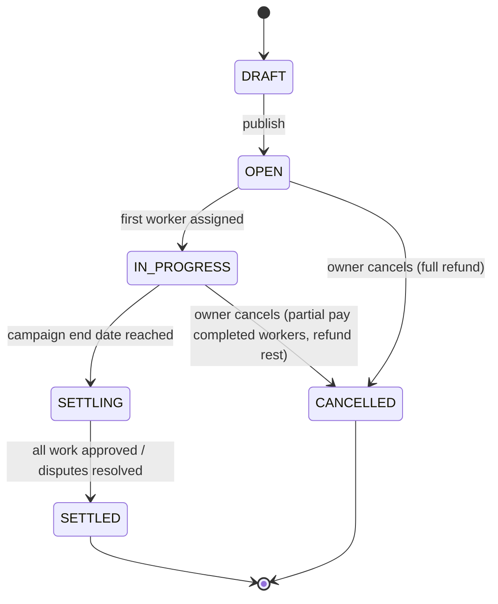
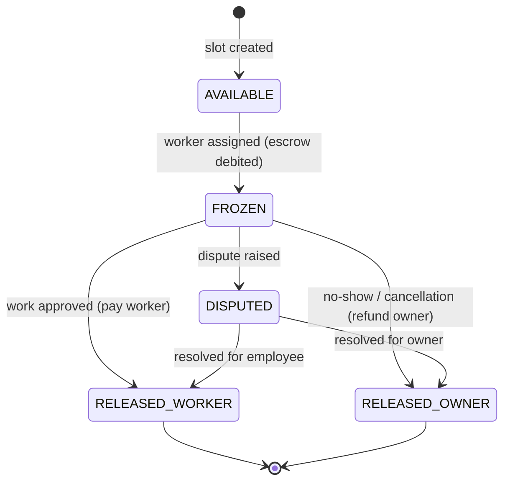

# KOINWORK BLUEPRINT
> **Single Source of Truth** — Consult this file before starting any task.

---

## Table of Contents
1. [Project Overview](#1-project-overview)
2. [Real-World Failure Analysis](#2-real-world-failure-analysis)
3. [Optimized Database Schema](#3-optimized-database-schema)
4. [Edge Functions (Server-Side Logic)](#4-edge-functions-server-side-logic)
5. [Optimized App Flow](#5-optimized-app-flow)
6. [Feed Algorithm v2](#6-feed-algorithm-v2)
7. [Security Hardened Architecture](#7-security-hardened-architecture)
8. [Scalability Plan](#8-scalability-plan)
9. [Development Phases (Updated)](#9-development-phases-updated)
10. [Checklist / Status Tracker](#10-checklist--status-tracker)
11. [Conventions & Rules](#11-conventions--rules)

---

## 1. Project Overview

### Platform Name
**KoinWork** (repository: `Worky`)

### Mission
A blue-collar gig economy platform connecting **Owners** (businesses/individuals who post jobs) with **Employees** (workers who browse, apply, work, and earn). The internal currency **KCoin** drives all transactions.

### KCoin Economy
| Unit | Value |
|------|-------|
| 1 KCoin | ₹10 |
| Minimum withdrawal | 50 KCoins (₹500) |
| Internal storage | **Paisa** (1 KCoin = 1000 paisa; ₹1 = 100 paisa) |

**Why paisa?** Floating-point arithmetic on `float` columns causes rounding drift over thousands of transactions. Integer paisa storage guarantees exact arithmetic.

### Tech Stack

| Layer | Technology |
|-------|-----------|
| Web frontend | Next.js 14 (App Router) |
| Mobile frontend | React Native with Expo |
| Backend / DB | Supabase (PostgreSQL + PostGIS + Realtime + Storage) |
| Auth | Supabase Auth (email, phone, Google OAuth) |
| Payments | Razorpay (India) / Stripe (international) |
| Edge Functions | Supabase Edge Functions (Deno) |
| Caching | Upstash Redis (session + feed cache) |
| Monitoring | Sentry (errors), Supabase Dashboard (perf) |

### User Roles

| Role | Capabilities |
|------|-------------|
| **Owner** | Create campaigns, fund escrow, approve work, manage workers, boost listings |
| **Employee** | Browse feed, apply to campaigns, check in/out, earn KCoins, withdraw to bank |

### Core Flow
```
Owner funds wallet → Creates campaign (escrow frozen) → Employee applies →
Owner approves → Employee checks in (geofenced) → Employee checks out →
Owner approves work → KCoins released to employee → Employee withdraws (KYC)
```

---

## 2. Real-World Failure Analysis

> This section documents every known failure mode and the production-grade fix for each. All fixes are reflected in the schema, edge functions, and app flow defined later.

---

### A. Wallet & KCoin Economy Failures

#### Failure 1 — Race Condition on Wallet Balance
**Scenario:** An owner with 100 KCoins simultaneously creates two 60-KCoin campaigns from two browser tabs.  
**Result:** Both reads return 100 KCoins (≥ 60), both debits succeed, balance goes to -20 KCoins.

```sql
-- BROKEN: two concurrent transactions both read balance = 10000000 paisa
SELECT available_balance FROM wallets WHERE user_id = $1; -- returns 10000000
UPDATE wallets SET available_balance = available_balance - 6000000 WHERE user_id = $1;
```

**Fix:** `SELECT ... FOR UPDATE` row-level lock inside a serializable transaction.

```sql
BEGIN;
SELECT available_balance FROM wallets WHERE user_id = $1 FOR UPDATE;
-- now other transactions block until this one commits
UPDATE wallets SET available_balance = available_balance - 6000000
WHERE user_id = $1 AND available_balance >= 6000000; -- guard check
COMMIT;
```

---

#### Failure 2 — Floating Point Rounding
**Scenario:** Storing KCoin balances as `float8`. After 10,000 micro-transactions, rounding errors accumulate.

```
1.1 + 2.2 = 3.3000000000000003  -- classic IEEE 754 drift
```

**Fix:** Store **all monetary values as integer paisa** (1 KCoin = 1,000 paisa; ₹1 = 100 paisa).

```typescript
// conversion helpers
const PAISA_PER_KCOIN = 1000;
const PAISA_PER_RUPEE = 100;

function kCoinsToPaisa(kcoins: number): number {
  return Math.round(kcoins * PAISA_PER_KCOIN); // integer, no drift
}

function paisaToKCoins(paisa: number): number {
  return paisa / PAISA_PER_KCOIN; // display only — always integer input
}
```

---

#### Failure 3 — Payment Gateway Webhook Retry Duplicates
**Scenario:** Razorpay fires a `payment.captured` webhook. The server is slow; Razorpay retries after 30 seconds. Both deliveries credit the wallet.

**Fix:** Idempotency keys on every transaction row.

```sql
INSERT INTO transactions (id, wallet_id, amount_paisa, type, idempotency_key, ...)
VALUES (gen_random_uuid(), $wallet_id, $amount, 'DEPOSIT', $razorpay_payment_id, ...)
ON CONFLICT (idempotency_key) DO NOTHING; -- safe retry
```

---

#### Failure 4 — Withdrawal Abuse (Spend After Withdraw Request)
**Scenario:** Employee requests withdrawal of 500 KCoins. Before it processes, they apply to a 300-KCoin campaign. Both succeed → negative balance.

**Fix:** Immediately freeze the withdrawal amount on request.

```sql
BEGIN;
UPDATE wallets
SET available_balance = available_balance - $amount,
    frozen_balance    = frozen_balance    + $amount
WHERE user_id = $1 AND available_balance >= $amount
RETURNING id;
-- if no row returned, raise error
INSERT INTO withdrawals (wallet_id, amount_paisa, status) VALUES ($wallet_id, $amount, 'PENDING');
COMMIT;
```

---

### B. Campaign Escrow System Failures

#### Failure 1 — Partial Worker Fill (Stuck Escrow)
**Scenario:** Campaign has 10 slots, budget 10,000 KCoins total. Only 3 workers apply and complete. The remaining 7,000 KCoins stay frozen forever.

**Fix:** Per-slot escrow instead of per-campaign lump-sum. Release unfilled slots on campaign close.

```
BEFORE: Freeze 10,000 KCoins for entire campaign upfront
AFTER:  Freeze 1,000 KCoins per slot only when a worker is ASSIGNED
        Release slot escrow immediately if worker cancels or no-shows
```

---

#### Failure 2 — Mid-Campaign Cancellation (No Defined Behavior)
**Scenario:** Owner cancels a 10-slot campaign after 4 workers have already worked.

**Fix:** Clear state machine + settlement edge function.



---

#### Failure 3 — Worker No-Show (Ghost Slot)
**Scenario:** Worker is accepted, slot is marked ASSIGNED, but worker never checks in. Slot is consumed, escrow frozen for ghost worker indefinitely.

**Fix:** 48-hour auto-release cron job.

```typescript
// runs every hour via cron
async function autoReleaseEscrow() {
  const noShows = await supabase
    .from('campaign_slots')
    .select('*')
    .eq('status', 'ASSIGNED')
    .lt('assigned_at', new Date(Date.now() - 48 * 60 * 60 * 1000).toISOString());

  for (const slot of noShows.data) {
    await releaseSlotEscrow(slot.id, 'NO_SHOW');
  }
}
```

---

#### Failure 4 — Escrow Refund Timing
**Scenario:** Campaign closes with 1 out of 10 workers. What fraction gets refunded and when?

**Fix:** Escrow state machine per slot.



---

### C. Location-Based Feed Performance

#### Failure 1 — No Spatial Indexing
**Scenario:** `SELECT * FROM campaigns WHERE ST_DWithin(location, $userLoc, 10000)` runs a full table scan on 1M rows. Every feed load takes 3–8 seconds.

**Fix:** PostGIS GiST index.

```sql
CREATE EXTENSION IF NOT EXISTS postgis;
CREATE INDEX idx_campaigns_location ON campaigns USING GIST (location);
-- now distance queries use index scan, not full table scan
```

---

#### Failure 2 — No Feed Caching
**Scenario:** 10,000 concurrent users all trigger the same expensive ST_DWithin + ranking query.

**Fix:** Materialized view per city, refreshed every 5 minutes.

```sql
CREATE MATERIALIZED VIEW feed_cache_mumbai AS
SELECT c.*, ST_Distance(c.location, ST_MakePoint(72.8777, 19.0760)::geography) AS distance_m
FROM campaigns c
WHERE c.status = 'OPEN'
  AND ST_DWithin(c.location, ST_MakePoint(72.8777, 19.0760)::geography, 50000)
ORDER BY feed_score DESC;

-- refresh via cron
REFRESH MATERIALIZED VIEW CONCURRENTLY feed_cache_mumbai;
```

---

#### Failure 3 — Stale Location Data
**Scenario:** User moved from Mumbai to Delhi 6 months ago. Profile location still shows Mumbai. Feed shows Mumbai jobs.

**Fix:** Periodic location prompt if location not updated in 30 days.

```typescript
const daysSinceUpdate = differenceInDays(new Date(), profile.location_updated_at);
if (daysSinceUpdate > 30) {
  showLocationRefreshPrompt();
}
```

---

### D. Check-in/Check-out Gaming

#### Failure 1 — No Location Verification
**Scenario:** Employee checks in from their home 10 km away from the job site.

**Fix:** Geofenced check-in (must be within 200 m of job site).

```typescript
const distanceMeters = geoDistance(userLat, userLng, jobLat, jobLng);
if (distanceMeters > 200) {
  throw new Error(`Must be within 200m of job site. You are ${distanceMeters.toFixed(0)}m away.`);
}
```

---

#### Failure 2 — No Time Validation
**Scenario:** Check in at 11:59 PM, check out at 12:01 AM = recorded as 2-day shift.

**Fix:** Store UTC timestamps, calculate duration server-side, enforce minimum 4-hour and maximum 16-hour shift.

```sql
CHECK (checkout_time > checkin_time),
CHECK (EXTRACT(EPOCH FROM (checkout_time - checkin_time)) / 3600 >= 4),   -- min 4h
CHECK (EXTRACT(EPOCH FROM (checkout_time - checkin_time)) / 3600 <= 16)   -- max 16h
```

---

#### Failure 3 — Manual Approval Bottleneck
**Scenario:** Campaign has 50 workers × 30 days = 1,500 approval decisions for the owner.

**Fix:** Batch approval UI with anomaly flagging. Auto-approve normal check-ins; flag anomalies for manual review.

```typescript
interface WorkLogFlags {
  distance_anomaly: boolean;    // > 200m from site
  duration_anomaly: boolean;    // < 4h or > 12h
  time_anomaly: boolean;        // outside scheduled hours
  location_jump: boolean;       // impossible travel speed
}
// Only flagged logs need manual review; clean logs auto-approved
```

---

### E. Realtime Subscription Scaling

#### Failure 1 — Per-Campaign Channels Hit Supabase Limits
**Scenario:** 100,000 active campaigns → 100,000 Realtime channels. Supabase default limit is far lower.

**Fix:** Aggregate channels by city/region.

```typescript
// BEFORE (broken): one channel per campaign
supabase.channel(`campaign:${campaignId}`)

// AFTER (fixed): one channel per city
supabase.channel(`city:${cityId}:feed`)
```

---

#### Failure 2 — Zombie Subscriptions
**Scenario:** User closes the app without the cleanup handler running. Subscription stays open, consuming server resources.

**Fix:** Heartbeat-based cleanup. If no heartbeat in 5 minutes, server-side cleanup releases the subscription.

```typescript
// client: send heartbeat every 60s
const heartbeat = setInterval(() => {
  channel.send({ type: 'broadcast', event: 'heartbeat', payload: { ts: Date.now() } });
}, 60_000);

// on unmount
clearInterval(heartbeat);
supabase.removeChannel(channel);
```

---

### F. Security Gaps

#### Failure 1 — Client-Side KCoin Calculations
**Scenario:** Client sends `{ amount: 99999 }` in a work approval request. Server trusts it.

**Fix:** ALL financial calculations server-side only, inside Edge Functions. Client provides intent only (`approve_work_log_id`), server calculates amount from DB.

---

#### Failure 2 — No Rate Limiting on Applications
**Scenario:** Bot creates 10,000 applications to drain campaigns or game the rating system.

**Fix:** Rate limit: 10 applications per hour per user, enforced in Edge Function + Upstash Redis.

```typescript
const key = `ratelimit:apply:${userId}`;
const count = await redis.incr(key);
if (count === 1) await redis.expire(key, 3600); // 1-hour window
if (count > 10) throw new Error('Rate limit exceeded: max 10 applications per hour');
```

---

#### Failure 3 — Fraud (Fake Owner + Fake Employee = Free Money)
**Scenario:** Attacker creates fake owner account, fake employee account. Fake campaign, fake work, withdrawal. Net ₹ out.

**Fix:** Fraud scoring system. New accounts + fast withdrawal pattern triggers hold.

| Signal | Score |
|--------|-------|
| Account age < 7 days | +30 |
| No KYC completed | +25 |
| First withdrawal within 48h of first earning | +20 |
| >3 applications in first hour | +15 |
| Score ≥ 50 | Auto-hold + manual review |

---

#### Failure 4 — Missing RLS Policies
**Fix:** Complete RLS policies for every table (see Section 7 for full SQL).

---

### G. Missing Critical Features

| Missing Feature | Risk Level | Planned Phase |
|----------------|-----------|---------------|
| Dispute resolution UI/workflow | High | Phase 7 |
| KYC / identity verification | Critical (regulatory) | Phase 4 |
| TDS for payments > ₹30K/year (Indian law) | Critical (legal) | Phase 4 |
| Multi-language (Hindi, regional languages) | High (UX) | Phase 6 |
| Offline mode (poor connectivity at job sites) | High (UX) | Phase 6 |
| Campaign templates (repeat job creation) | Medium | Phase 5 |
| Worker rating decay (old 5-star ≠ current) | Medium | Phase 5 |
| Surge / demand pricing suggestions | Low | Phase 7 |

---

## 3. Optimized Database Schema

```sql
-- ============================================================
-- EXTENSIONS
-- ============================================================
CREATE EXTENSION IF NOT EXISTS postgis;
CREATE EXTENSION IF NOT EXISTS "uuid-ossp";
CREATE EXTENSION IF NOT EXISTS pgcrypto;

-- ============================================================
-- ENUMS
-- ============================================================
CREATE TYPE user_role AS ENUM ('owner', 'employee');
CREATE TYPE kyc_status AS ENUM ('NOT_SUBMITTED', 'PENDING', 'APPROVED', 'REJECTED');

CREATE TYPE transaction_type AS ENUM (
  'DEPOSIT',
  'ESCROW_FREEZE',
  'ESCROW_RELEASE',
  'PAYMENT',
  'WITHDRAWAL',
  'REFUND',
  'BOOST_FEE'
);

CREATE TYPE transaction_status AS ENUM (
  'PENDING',
  'COMPLETED',
  'FAILED',
  'REVERSED'
);

CREATE TYPE campaign_status AS ENUM (
  'DRAFT',
  'OPEN',
  'IN_PROGRESS',
  'SETTLING',
  'SETTLED',
  'CANCELLED'
);

CREATE TYPE escrow_status AS ENUM (
  'NONE',
  'FROZEN',
  'PARTIAL_RELEASE',
  'SETTLED',
  'REFUNDED'
);

CREATE TYPE slot_status AS ENUM (
  'AVAILABLE',
  'APPLIED',
  'ASSIGNED',
  'COMPLETED',
  'NO_SHOW',
  'DISPUTED',
  'CANCELLED'
);

CREATE TYPE application_status AS ENUM (
  'PENDING',
  'ACCEPTED',
  'REJECTED',
  'WITHDRAWN'
);

CREATE TYPE withdrawal_status AS ENUM (
  'PENDING',
  'PROCESSING',
  'COMPLETED',
  'FAILED',
  'CANCELLED'
);

CREATE TYPE dispute_status AS ENUM (
  'OPEN',
  'UNDER_REVIEW',
  'RESOLVED_OWNER',
  'RESOLVED_EMPLOYEE',
  'CLOSED'
);

CREATE TYPE boost_tier AS ENUM ('BASIC', 'STANDARD', 'PREMIUM');

CREATE TYPE notification_type AS ENUM (
  'APPLICATION_RECEIVED',
  'APPLICATION_ACCEPTED',
  'APPLICATION_REJECTED',
  'WORK_APPROVED',
  'PAYMENT_RECEIVED',
  'WITHDRAWAL_PROCESSED',
  'DISPUTE_UPDATE',
  'CAMPAIGN_UPDATE',
  'SYSTEM'
);

-- ============================================================
-- PROFILES
-- ============================================================
CREATE TABLE profiles (
  id                   UUID PRIMARY KEY REFERENCES auth.users(id) ON DELETE CASCADE,
  role                 user_role NOT NULL,
  full_name            TEXT NOT NULL,
  phone                TEXT UNIQUE,
  avatar_url           TEXT,
  bio                  TEXT,
  -- PostGIS geography for distance calculations
  location             geography(Point, 4326),
  city                 TEXT,
  state                TEXT,
  location_updated_at  TIMESTAMPTZ DEFAULT NOW(),
  kyc_status           kyc_status NOT NULL DEFAULT 'NOT_SUBMITTED',
  kyc_verified_at      TIMESTAMPTZ,
  -- aggregate rating (stored denormalized for feed performance)
  avg_rating           NUMERIC(3,2) DEFAULT 0,
  total_reviews        INT DEFAULT 0,
  is_active            BOOLEAN DEFAULT TRUE,
  created_at           TIMESTAMPTZ DEFAULT NOW(),
  updated_at           TIMESTAMPTZ DEFAULT NOW()
);

CREATE INDEX idx_profiles_location ON profiles USING GIST (location);
CREATE INDEX idx_profiles_role ON profiles (role);
CREATE INDEX idx_profiles_city ON profiles (city);

ALTER TABLE profiles ENABLE ROW LEVEL SECURITY;

-- ============================================================
-- WALLETS
-- ============================================================
-- All monetary values stored in PAISA (integer)
-- 1 KCoin = 1000 paisa | ₹1 = 100 paisa | 1 KCoin = ₹10 = 1000 paisa
CREATE TABLE wallets (
  id                UUID PRIMARY KEY DEFAULT gen_random_uuid(),
  user_id           UUID NOT NULL UNIQUE REFERENCES profiles(id) ON DELETE CASCADE,
  -- paisa amounts (integer — no floating point)
  available_balance BIGINT NOT NULL DEFAULT 0 CHECK (available_balance >= 0),
  frozen_balance    BIGINT NOT NULL DEFAULT 0 CHECK (frozen_balance >= 0),
  lifetime_earned   BIGINT NOT NULL DEFAULT 0,
  lifetime_spent    BIGINT NOT NULL DEFAULT 0,
  created_at        TIMESTAMPTZ DEFAULT NOW(),
  updated_at        TIMESTAMPTZ DEFAULT NOW()
);

CREATE INDEX idx_wallets_user_id ON wallets (user_id);

ALTER TABLE wallets ENABLE ROW LEVEL SECURITY;

-- ============================================================
-- TRANSACTIONS
-- ============================================================
CREATE TABLE transactions (
  id               UUID PRIMARY KEY DEFAULT gen_random_uuid(),
  wallet_id        UUID NOT NULL REFERENCES wallets(id),
  amount_paisa     BIGINT NOT NULL,
  type             transaction_type NOT NULL,
  status           transaction_status NOT NULL DEFAULT 'PENDING',
  -- idempotency_key prevents duplicate credits on webhook retry
  idempotency_key  TEXT NOT NULL UNIQUE,
  reference_id     UUID,              -- campaign_id, withdrawal_id, etc.
  reference_type   TEXT,              -- 'campaign', 'withdrawal', 'boost_purchase'
  description      TEXT,
  metadata         JSONB DEFAULT '{}',
  created_at       TIMESTAMPTZ DEFAULT NOW(),
  updated_at       TIMESTAMPTZ DEFAULT NOW()
);

CREATE UNIQUE INDEX idx_transactions_idempotency ON transactions (idempotency_key);
CREATE INDEX idx_transactions_wallet_id ON transactions (wallet_id);
CREATE INDEX idx_transactions_reference ON transactions (reference_id, reference_type);
CREATE INDEX idx_transactions_created_at ON transactions (created_at DESC);

ALTER TABLE transactions ENABLE ROW LEVEL SECURITY;

-- ============================================================
-- CAMPAIGNS
-- ============================================================
CREATE TABLE campaigns (
  id                UUID PRIMARY KEY DEFAULT gen_random_uuid(),
  owner_id          UUID NOT NULL REFERENCES profiles(id),
  title             TEXT NOT NULL,
  description       TEXT NOT NULL,
  category          TEXT NOT NULL,
  -- pay per slot in paisa
  pay_per_slot_paisa BIGINT NOT NULL CHECK (pay_per_slot_paisa > 0),
  total_slots       INT NOT NULL CHECK (total_slots > 0),
  filled_slots      INT NOT NULL DEFAULT 0,
  -- PostGIS location
  location          geography(Point, 4326) NOT NULL,
  address           TEXT NOT NULL,
  city              TEXT NOT NULL,
  state             TEXT NOT NULL,
  -- scheduling
  start_date        DATE NOT NULL,
  end_date          DATE NOT NULL,
  shift_start_time  TIME NOT NULL,
  shift_end_time    TIME NOT NULL,
  -- state machine
  status            campaign_status NOT NULL DEFAULT 'DRAFT',
  escrow_status     escrow_status NOT NULL DEFAULT 'NONE',
  -- boost
  boost_tier        boost_tier,
  boost_expires_at  TIMESTAMPTZ,
  -- feed score (denormalized for performance)
  feed_score        NUMERIC(10,4) DEFAULT 0,
  -- template
  is_template       BOOLEAN DEFAULT FALSE,
  template_name     TEXT,
  created_at        TIMESTAMPTZ DEFAULT NOW(),
  updated_at        TIMESTAMPTZ DEFAULT NOW(),
  CHECK (end_date >= start_date)
);

CREATE INDEX idx_campaigns_location ON campaigns USING GIST (location);
CREATE INDEX idx_campaigns_status ON campaigns (status);
CREATE INDEX idx_campaigns_owner_id ON campaigns (owner_id);
CREATE INDEX idx_campaigns_city ON campaigns (city);
CREATE INDEX idx_campaigns_category ON campaigns (category);
CREATE INDEX idx_campaigns_feed_score ON campaigns (feed_score DESC) WHERE status = 'OPEN';
CREATE INDEX idx_campaigns_boost ON campaigns (boost_expires_at) WHERE boost_tier IS NOT NULL;

ALTER TABLE campaigns ENABLE ROW LEVEL SECURITY;

-- ============================================================
-- CAMPAIGN SLOTS (per-worker escrow tracking)
-- ============================================================
CREATE TABLE campaign_slots (
  id                  UUID PRIMARY KEY DEFAULT gen_random_uuid(),
  campaign_id         UUID NOT NULL REFERENCES campaigns(id) ON DELETE CASCADE,
  employee_id         UUID REFERENCES profiles(id),
  status              slot_status NOT NULL DEFAULT 'AVAILABLE',
  -- per-slot escrow amount (frozen from owner's wallet)
  escrow_amount_paisa BIGINT NOT NULL DEFAULT 0,
  escrow_transaction_id UUID REFERENCES transactions(id),
  -- timestamps
  assigned_at         TIMESTAMPTZ,
  completed_at        TIMESTAMPTZ,
  released_at         TIMESTAMPTZ,
  created_at          TIMESTAMPTZ DEFAULT NOW(),
  updated_at          TIMESTAMPTZ DEFAULT NOW()
);

CREATE INDEX idx_campaign_slots_campaign_id ON campaign_slots (campaign_id);
CREATE INDEX idx_campaign_slots_employee_id ON campaign_slots (employee_id);
CREATE INDEX idx_campaign_slots_status ON campaign_slots (status);
-- for no-show detection cron job
CREATE INDEX idx_campaign_slots_no_show ON campaign_slots (assigned_at)
  WHERE status = 'ASSIGNED';

ALTER TABLE campaign_slots ENABLE ROW LEVEL SECURITY;

-- ============================================================
-- APPLICATIONS
-- ============================================================
CREATE TABLE applications (
  id          UUID PRIMARY KEY DEFAULT gen_random_uuid(),
  campaign_id UUID NOT NULL REFERENCES campaigns(id) ON DELETE CASCADE,
  employee_id UUID NOT NULL REFERENCES profiles(id) ON DELETE CASCADE,
  slot_id     UUID REFERENCES campaign_slots(id),
  status      application_status NOT NULL DEFAULT 'PENDING',
  cover_note  TEXT,
  created_at  TIMESTAMPTZ DEFAULT NOW(),
  updated_at  TIMESTAMPTZ DEFAULT NOW(),
  UNIQUE (campaign_id, employee_id)  -- one application per campaign per employee
);

CREATE INDEX idx_applications_campaign_id ON applications (campaign_id);
CREATE INDEX idx_applications_employee_id ON applications (employee_id);
CREATE INDEX idx_applications_status ON applications (status);
-- rate limit check: count recent applications by employee
CREATE INDEX idx_applications_rate_limit ON applications (employee_id, created_at DESC);

ALTER TABLE applications ENABLE ROW LEVEL SECURITY;

-- ============================================================
-- WORK LOGS
-- ============================================================
CREATE TABLE work_logs (
  id                         UUID PRIMARY KEY DEFAULT gen_random_uuid(),
  slot_id                    UUID NOT NULL REFERENCES campaign_slots(id) ON DELETE CASCADE,
  campaign_id                UUID NOT NULL REFERENCES campaigns(id),
  employee_id                UUID NOT NULL REFERENCES profiles(id),
  -- check-in
  checkin_time               TIMESTAMPTZ NOT NULL,
  checkin_lat                DOUBLE PRECISION NOT NULL,
  checkin_lng                DOUBLE PRECISION NOT NULL,
  checkin_distance_meters    DOUBLE PRECISION NOT NULL, -- distance from job site at check-in
  checkin_photo_url          TEXT,
  -- check-out
  checkout_time              TIMESTAMPTZ,
  checkout_lat               DOUBLE PRECISION,
  checkout_lng               DOUBLE PRECISION,
  checkout_distance_meters   DOUBLE PRECISION,
  checkout_photo_url         TEXT,
  -- calculated fields
  shift_duration_minutes     INT,  -- computed on checkout
  -- approval
  is_approved                BOOLEAN,
  approved_by                UUID REFERENCES profiles(id),
  approved_at                TIMESTAMPTZ,
  -- anomaly flags (for batch approval UI)
  flag_distance_anomaly      BOOLEAN DEFAULT FALSE,
  flag_duration_anomaly      BOOLEAN DEFAULT FALSE,
  flag_time_anomaly          BOOLEAN DEFAULT FALSE,
  flag_location_jump         BOOLEAN DEFAULT FALSE,
  -- constraints
  created_at                 TIMESTAMPTZ DEFAULT NOW(),
  updated_at                 TIMESTAMPTZ DEFAULT NOW(),
  -- server-enforced validations
  CONSTRAINT valid_checkout_after_checkin
    CHECK (checkout_time IS NULL OR checkout_time > checkin_time),
  CONSTRAINT valid_min_shift
    CHECK (
      checkout_time IS NULL OR
      EXTRACT(EPOCH FROM (checkout_time - checkin_time)) / 3600 >= 4
    ),
  CONSTRAINT valid_max_shift
    CHECK (
      checkout_time IS NULL OR
      EXTRACT(EPOCH FROM (checkout_time - checkin_time)) / 3600 <= 16
    ),
  CONSTRAINT valid_checkin_distance
    CHECK (checkin_distance_meters <= 200)  -- must be within 200m
);

CREATE INDEX idx_work_logs_slot_id ON work_logs (slot_id);
CREATE INDEX idx_work_logs_employee_id ON work_logs (employee_id);
CREATE INDEX idx_work_logs_campaign_id ON work_logs (campaign_id);
CREATE INDEX idx_work_logs_pending_approval ON work_logs (campaign_id, is_approved)
  WHERE is_approved IS NULL;
CREATE INDEX idx_work_logs_flagged ON work_logs (campaign_id)
  WHERE flag_distance_anomaly OR flag_duration_anomaly
     OR flag_time_anomaly OR flag_location_jump;

ALTER TABLE work_logs ENABLE ROW LEVEL SECURITY;

-- ============================================================
-- WITHDRAWALS
-- ============================================================
CREATE TABLE withdrawals (
  id                   UUID PRIMARY KEY DEFAULT gen_random_uuid(),
  wallet_id            UUID NOT NULL REFERENCES wallets(id),
  user_id              UUID NOT NULL REFERENCES profiles(id),
  amount_paisa         BIGINT NOT NULL CHECK (amount_paisa > 0),
  status               withdrawal_status NOT NULL DEFAULT 'PENDING',
  -- bank details (should be encrypted at rest in production)
  bank_account_number  TEXT NOT NULL,
  bank_ifsc            TEXT NOT NULL,
  bank_account_name    TEXT NOT NULL,
  -- KYC reference
  kyc_status_at_request kyc_status NOT NULL,
  -- payment gateway
  razorpay_payout_id   TEXT,
  failure_reason       TEXT,
  -- TDS
  tds_deducted_paisa   BIGINT DEFAULT 0,
  -- freeze transaction reference
  freeze_transaction_id UUID REFERENCES transactions(id),
  processed_at         TIMESTAMPTZ,
  created_at           TIMESTAMPTZ DEFAULT NOW(),
  updated_at           TIMESTAMPTZ DEFAULT NOW()
);

CREATE INDEX idx_withdrawals_user_id ON withdrawals (user_id);
CREATE INDEX idx_withdrawals_wallet_id ON withdrawals (wallet_id);
CREATE INDEX idx_withdrawals_status ON withdrawals (status);

ALTER TABLE withdrawals ENABLE ROW LEVEL SECURITY;

-- ============================================================
-- DISPUTES
-- ============================================================
CREATE TABLE disputes (
  id             UUID PRIMARY KEY DEFAULT gen_random_uuid(),
  work_log_id    UUID NOT NULL REFERENCES work_logs(id),
  campaign_id    UUID NOT NULL REFERENCES campaigns(id),
  raised_by      UUID NOT NULL REFERENCES profiles(id),
  against        UUID NOT NULL REFERENCES profiles(id),
  status         dispute_status NOT NULL DEFAULT 'OPEN',
  reason         TEXT NOT NULL,
  evidence_urls  TEXT[] DEFAULT '{}',
  -- admin resolution
  resolved_by    UUID REFERENCES profiles(id),
  resolution_note TEXT,
  resolved_at    TIMESTAMPTZ,
  created_at     TIMESTAMPTZ DEFAULT NOW(),
  updated_at     TIMESTAMPTZ DEFAULT NOW()
);

CREATE INDEX idx_disputes_campaign_id ON disputes (campaign_id);
CREATE INDEX idx_disputes_raised_by ON disputes (raised_by);
CREATE INDEX idx_disputes_status ON disputes (status);

ALTER TABLE disputes ENABLE ROW LEVEL SECURITY;

-- ============================================================
-- BOOST PURCHASES
-- ============================================================
CREATE TABLE boost_purchases (
  id                UUID PRIMARY KEY DEFAULT gen_random_uuid(),
  campaign_id       UUID NOT NULL REFERENCES campaigns(id),
  owner_id          UUID NOT NULL REFERENCES profiles(id),
  tier              boost_tier NOT NULL,
  cost_paisa        BIGINT NOT NULL,
  duration_hours    INT NOT NULL,
  starts_at         TIMESTAMPTZ NOT NULL DEFAULT NOW(),
  expires_at        TIMESTAMPTZ NOT NULL,
  transaction_id    UUID REFERENCES transactions(id),
  created_at        TIMESTAMPTZ DEFAULT NOW()
);

CREATE INDEX idx_boost_purchases_campaign_id ON boost_purchases (campaign_id);
CREATE INDEX idx_boost_purchases_expires_at ON boost_purchases (expires_at)
  WHERE expires_at > NOW();

ALTER TABLE boost_purchases ENABLE ROW LEVEL SECURITY;

-- ============================================================
-- NOTIFICATIONS
-- ============================================================
CREATE TABLE notifications (
  id          UUID PRIMARY KEY DEFAULT gen_random_uuid(),
  user_id     UUID NOT NULL REFERENCES profiles(id) ON DELETE CASCADE,
  type        notification_type NOT NULL,
  title       TEXT NOT NULL,
  body        TEXT NOT NULL,
  data        JSONB DEFAULT '{}',
  is_read     BOOLEAN DEFAULT FALSE,
  created_at  TIMESTAMPTZ DEFAULT NOW()
);

CREATE INDEX idx_notifications_user_id ON notifications (user_id, is_read, created_at DESC);

ALTER TABLE notifications ENABLE ROW LEVEL SECURITY;

-- ============================================================
-- FRAUD FLAGS
-- ============================================================
CREATE TABLE fraud_flags (
  id           UUID PRIMARY KEY DEFAULT gen_random_uuid(),
  user_id      UUID NOT NULL REFERENCES profiles(id),
  score        INT NOT NULL DEFAULT 0,
  signals      JSONB DEFAULT '{}',  -- { account_age_days: 3, fast_withdrawal: true, ... }
  is_resolved  BOOLEAN DEFAULT FALSE,
  reviewed_by  UUID REFERENCES profiles(id),
  notes        TEXT,
  created_at   TIMESTAMPTZ DEFAULT NOW(),
  updated_at   TIMESTAMPTZ DEFAULT NOW()
);

CREATE INDEX idx_fraud_flags_user_id ON fraud_flags (user_id);
CREATE INDEX idx_fraud_flags_unresolved ON fraud_flags (score DESC)
  WHERE is_resolved = FALSE;

ALTER TABLE fraud_flags ENABLE ROW LEVEL SECURITY;

-- ============================================================
-- REVIEWS
-- ============================================================
CREATE TABLE reviews (
  id            UUID PRIMARY KEY DEFAULT gen_random_uuid(),
  campaign_id   UUID NOT NULL REFERENCES campaigns(id),
  reviewer_id   UUID NOT NULL REFERENCES profiles(id),
  reviewee_id   UUID NOT NULL REFERENCES profiles(id),
  rating        INT NOT NULL CHECK (rating BETWEEN 1 AND 5),
  comment       TEXT,
  -- for rating decay: weight decreases over time
  created_at    TIMESTAMPTZ DEFAULT NOW(),
  UNIQUE (campaign_id, reviewer_id, reviewee_id)
);

CREATE INDEX idx_reviews_reviewee_id ON reviews (reviewee_id, created_at DESC);

ALTER TABLE reviews ENABLE ROW LEVEL SECURITY;

-- ============================================================
-- TRIGGERS
-- ============================================================

-- Auto-update updated_at
CREATE OR REPLACE FUNCTION update_updated_at()
RETURNS TRIGGER LANGUAGE plpgsql AS $$
BEGIN
  NEW.updated_at = NOW();
  RETURN NEW;
END;
$$;

DO $$
DECLARE tbl TEXT;
BEGIN
  FOREACH tbl IN ARRAY ARRAY[
    'profiles','wallets','transactions','campaigns','campaign_slots',
    'applications','work_logs','withdrawals','disputes','fraud_flags'
  ] LOOP
    EXECUTE format(
      'CREATE TRIGGER trg_%s_updated_at
       BEFORE UPDATE ON %s
       FOR EACH ROW EXECUTE FUNCTION update_updated_at()',
      tbl, tbl
    );
  END LOOP;
END;
$$;

-- Trigger: freeze wallet on withdrawal request
CREATE OR REPLACE FUNCTION freeze_withdrawal_amount()
RETURNS TRIGGER LANGUAGE plpgsql SECURITY DEFINER AS $$
BEGIN
  UPDATE wallets
  SET available_balance = available_balance - NEW.amount_paisa,
      frozen_balance    = frozen_balance    + NEW.amount_paisa
  WHERE id = NEW.wallet_id
    AND available_balance >= NEW.amount_paisa;

  IF NOT FOUND THEN
    RAISE EXCEPTION 'Insufficient available balance for withdrawal';
  END IF;
  RETURN NEW;
END;
$$;

CREATE TRIGGER trg_freeze_on_withdrawal
AFTER INSERT ON withdrawals
FOR EACH ROW
WHEN (NEW.status = 'PENDING')
EXECUTE FUNCTION freeze_withdrawal_amount();

-- Trigger: auto-compute shift_duration_minutes on work log checkout
CREATE OR REPLACE FUNCTION compute_shift_duration()
RETURNS TRIGGER LANGUAGE plpgsql AS $$
BEGIN
  IF NEW.checkout_time IS NOT NULL AND OLD.checkout_time IS NULL THEN
    NEW.shift_duration_minutes :=
      EXTRACT(EPOCH FROM (NEW.checkout_time - NEW.checkin_time)) / 60;
  END IF;
  RETURN NEW;
END;
$$;

CREATE TRIGGER trg_compute_shift_duration
BEFORE UPDATE ON work_logs
FOR EACH ROW EXECUTE FUNCTION compute_shift_duration();
```

---

## 4. Edge Functions (Server-Side Logic)

> All financial calculations are **server-side only**. Clients send intent (IDs), not amounts.

### 4.1 `create-campaign`

```typescript
// supabase/functions/create-campaign/index.ts
import { createClient } from '@supabase/supabase-js';

const supabase = createClient(
  Deno.env.get('SUPABASE_URL')!,
  Deno.env.get('SUPABASE_SERVICE_ROLE_KEY')!
);

export default async function handler(req: Request): Promise<Response> {
  const { owner_id, title, description, category, pay_per_slot_paisa,
          total_slots, location, address, city, state,
          start_date, end_date, shift_start_time, shift_end_time } = await req.json();

  // 1. Validate required escrow = pay_per_slot * total_slots
  const requiredEscrowPaisa = pay_per_slot_paisa * total_slots;

  // 2. Begin atomic transaction
  const { data, error } = await supabase.rpc('create_campaign_atomic', {
    p_owner_id:            owner_id,
    p_title:               title,
    p_description:         description,
    p_category:            category,
    p_pay_per_slot_paisa:  pay_per_slot_paisa,
    p_total_slots:         total_slots,
    p_location_lng:        location.lng,
    p_location_lat:        location.lat,
    p_address:             address,
    p_city:                city,
    p_state:               state,
    p_start_date:          start_date,
    p_end_date:            end_date,
    p_shift_start_time:    shift_start_time,
    p_shift_end_time:      shift_end_time,
    p_required_escrow:     requiredEscrowPaisa,
    p_idempotency_key:     `create-campaign:${owner_id}:${title}:${start_date}`,
  });

  if (error) {
    return new Response(JSON.stringify({ error: error.message }), { status: 400 });
  }

  return new Response(JSON.stringify({ campaign: data }), { status: 201 });
}
```

```sql
-- Atomic PL/pgSQL function called by the Edge Function
CREATE OR REPLACE FUNCTION create_campaign_atomic(
  p_owner_id UUID, p_title TEXT, p_description TEXT, p_category TEXT,
  p_pay_per_slot_paisa BIGINT, p_total_slots INT,
  p_location_lng DOUBLE PRECISION, p_location_lat DOUBLE PRECISION,
  p_address TEXT, p_city TEXT, p_state TEXT,
  p_start_date DATE, p_end_date DATE,
  p_shift_start_time TIME, p_shift_end_time TIME,
  p_required_escrow BIGINT, p_idempotency_key TEXT
) RETURNS JSONB LANGUAGE plpgsql SECURITY DEFINER AS $$
DECLARE
  v_wallet wallets%ROWTYPE;
  v_campaign_id UUID;
  v_transaction_id UUID;
BEGIN
  -- Lock wallet row to prevent race condition
  SELECT * INTO v_wallet FROM wallets WHERE user_id = p_owner_id FOR UPDATE;

  IF v_wallet.available_balance < p_required_escrow THEN
    RAISE EXCEPTION 'Insufficient balance. Required: %, Available: %',
      p_required_escrow, v_wallet.available_balance;
  END IF;

  -- Create campaign
  INSERT INTO campaigns (
    owner_id, title, description, category, pay_per_slot_paisa,
    total_slots, location, address, city, state,
    start_date, end_date, shift_start_time, shift_end_time,
    status, escrow_status
  ) VALUES (
    p_owner_id, p_title, p_description, p_category, p_pay_per_slot_paisa,
    p_total_slots,
    ST_MakePoint(p_location_lng, p_location_lat)::geography,
    p_address, p_city, p_state,
    p_start_date, p_end_date, p_shift_start_time, p_shift_end_time,
    'OPEN', 'FROZEN'
  ) RETURNING id INTO v_campaign_id;

  -- Create campaign slots
  INSERT INTO campaign_slots (campaign_id, escrow_amount_paisa)
  SELECT v_campaign_id, p_pay_per_slot_paisa
  FROM generate_series(1, p_total_slots);

  -- Record transaction
  INSERT INTO transactions (
    wallet_id, amount_paisa, type, status, idempotency_key,
    reference_id, reference_type, description
  ) VALUES (
    v_wallet.id, -p_required_escrow, 'ESCROW_FREEZE', 'COMPLETED',
    p_idempotency_key, v_campaign_id, 'campaign',
    'Escrow freeze for campaign: ' || p_title
  ) RETURNING id INTO v_transaction_id;

  -- Debit wallet
  UPDATE wallets
  SET available_balance = available_balance - p_required_escrow,
      frozen_balance    = frozen_balance    + p_required_escrow,
      lifetime_spent    = lifetime_spent    + p_required_escrow
  WHERE id = v_wallet.id;

  RETURN jsonb_build_object('campaign_id', v_campaign_id, 'transaction_id', v_transaction_id);
END;
$$;
```

---

### 4.2 `apply-to-campaign`

```typescript
// supabase/functions/apply-to-campaign/index.ts
import { Redis } from '@upstash/redis';

const redis = new Redis({
  url: Deno.env.get('UPSTASH_REDIS_URL')!,
  token: Deno.env.get('UPSTASH_REDIS_TOKEN')!,
});

export default async function handler(req: Request): Promise<Response> {
  const { employee_id, campaign_id, cover_note } = await req.json();

  // 1. Rate limiting: max 10 applications per hour
  const rateLimitKey = `ratelimit:apply:${employee_id}`;
  const count = await redis.incr(rateLimitKey);
  if (count === 1) await redis.expire(rateLimitKey, 3600);
  if (count > 10) {
    return new Response(
      JSON.stringify({ error: 'Rate limit: max 10 applications per hour' }),
      { status: 429 }
    );
  }

  // 2. Check for duplicate application
  const { data: existing } = await supabase
    .from('applications')
    .select('id')
    .eq('campaign_id', campaign_id)
    .eq('employee_id', employee_id)
    .single();

  if (existing) {
    return new Response(
      JSON.stringify({ error: 'Already applied to this campaign' }),
      { status: 409 }
    );
  }

  // 3. Check slot availability
  const { data: campaign } = await supabase
    .from('campaigns')
    .select('total_slots, filled_slots, status')
    .eq('id', campaign_id)
    .single();

  if (!campaign || campaign.status !== 'OPEN') {
    return new Response(JSON.stringify({ error: 'Campaign not available' }), { status: 400 });
  }

  if (campaign.filled_slots >= campaign.total_slots) {
    return new Response(JSON.stringify({ error: 'No slots available' }), { status: 400 });
  }

  // 4. Create application
  const { data: application, error } = await supabase
    .from('applications')
    .insert({ campaign_id, employee_id, cover_note, status: 'PENDING' })
    .select()
    .single();

  if (error) {
    return new Response(JSON.stringify({ error: error.message }), { status: 400 });
  }

  // 5. Notify owner
  await notifyOwner(campaign_id, employee_id);

  return new Response(JSON.stringify({ application }), { status: 201 });
}
```

---

### 4.3 `approve-work`

```typescript
// supabase/functions/approve-work/index.ts
export default async function handler(req: Request): Promise<Response> {
  const { work_log_id, owner_id, approved } = await req.json();

  // 1. Fetch work log (server computes amount — never trust client)
  const { data: workLog } = await supabase
    .from('work_logs')
    .select('*, campaign_slots(escrow_amount_paisa, campaign_id), campaigns(owner_id)')
    .eq('id', work_log_id)
    .single();

  if (!workLog) {
    return new Response(JSON.stringify({ error: 'Work log not found' }), { status: 404 });
  }

  // 2. Verify owner owns the campaign
  if (workLog.campaigns.owner_id !== owner_id) {
    return new Response(JSON.stringify({ error: 'Unauthorized' }), { status: 403 });
  }

  // 3. Geofence re-validation (server-side)
  if (workLog.checkin_distance_meters > 200) {
    return new Response(
      JSON.stringify({ error: 'Check-in location outside geofence' }),
      { status: 400 }
    );
  }

  // 4. Minimum shift check (server-side)
  if (workLog.shift_duration_minutes < 240) { // 4 hours
    return new Response(
      JSON.stringify({ error: 'Shift too short (minimum 4 hours)' }),
      { status: 400 }
    );
  }

  if (!approved) {
    // Owner rejected — release escrow back to owner
    await releaseEscrowToOwner(workLog.campaign_slots.id, 'OWNER_REJECTED', work_log_id);
    return new Response(JSON.stringify({ status: 'rejected' }), { status: 200 });
  }

  // 5. Atomic: release escrow → credit employee wallet
  const amountPaisa = workLog.campaign_slots.escrow_amount_paisa;
  const idempotencyKey = `approve-work:${work_log_id}`;

  const { error } = await supabase.rpc('approve_work_atomic', {
    p_work_log_id:      work_log_id,
    p_slot_id:          workLog.campaign_slots.id,
    p_employee_id:      workLog.employee_id,
    p_amount_paisa:     amountPaisa,
    p_idempotency_key:  idempotencyKey,
  });

  if (error) {
    return new Response(JSON.stringify({ error: error.message }), { status: 500 });
  }

  return new Response(JSON.stringify({ status: 'approved', amount_paisa: amountPaisa }), {
    status: 200,
  });
}
```

---

### 4.4 `process-withdrawal`

```typescript
// supabase/functions/process-withdrawal/index.ts
export default async function handler(req: Request): Promise<Response> {
  const { user_id, amount_paisa, bank_account_number, bank_ifsc, bank_account_name } =
    await req.json();

  // 1. KYC check (mandatory before withdrawal)
  const { data: profile } = await supabase
    .from('profiles')
    .select('kyc_status')
    .eq('id', user_id)
    .single();

  if (profile?.kyc_status !== 'APPROVED') {
    return new Response(
      JSON.stringify({ error: 'KYC verification required before withdrawal' }),
      { status: 403 }
    );
  }

  // 2. Fraud score check
  const fraudScore = await computeFraudScore(user_id);
  if (fraudScore >= 50) {
    await flagForReview(user_id, fraudScore);
    return new Response(
      JSON.stringify({ error: 'Withdrawal under review. Support will contact you.' }),
      { status: 202 }
    );
  }

  // 3. TDS calculation (₹30,000/year = 3,000,000 paisa threshold)
  const yearlyEarningsPaisa = await getYearlyEarnings(user_id);
  const TDS_THRESHOLD_PAISA = 3_000_000; // ₹30,000
  const TDS_RATE = 0.10; // 10%
  let tdsDeductedPaisa = 0;
  if (yearlyEarningsPaisa + amount_paisa > TDS_THRESHOLD_PAISA) {
    const taxableAmount = Math.max(0, yearlyEarningsPaisa + amount_paisa - TDS_THRESHOLD_PAISA);
    tdsDeductedPaisa = Math.round(taxableAmount * TDS_RATE);
  }

  const netAmountPaisa = amount_paisa - tdsDeductedPaisa;

  // 4. Create withdrawal record (trigger auto-freezes wallet balance)
  const { data: withdrawal, error } = await supabase
    .from('withdrawals')
    .insert({
      user_id,
      wallet_id: await getWalletId(user_id),
      amount_paisa,
      bank_account_number,
      bank_ifsc,
      bank_account_name,
      kyc_status_at_request: profile.kyc_status,
      tds_deducted_paisa: tdsDeductedPaisa,
      status: 'PENDING',
    })
    .select()
    .single();

  if (error) {
    return new Response(JSON.stringify({ error: error.message }), { status: 400 });
  }

  // 5. Initiate Razorpay payout
  const payout = await razorpay.payouts.create({
    account_number: Deno.env.get('RAZORPAY_ACCOUNT_NUMBER'),
    fund_account: { account_type: 'bank_account', bank_account: { name: bank_account_name, ifsc: bank_ifsc, account_number: bank_account_number } },
    amount: netAmountPaisa,  // Razorpay uses paisa
    currency: 'INR',
    mode: 'IMPS',
    purpose: 'payout',
    reference_id: withdrawal.id,
  });

  // 6. Update withdrawal with payout ID
  await supabase
    .from('withdrawals')
    .update({ razorpay_payout_id: payout.id, status: 'PROCESSING' })
    .eq('id', withdrawal.id);

  return new Response(
    JSON.stringify({ withdrawal_id: withdrawal.id, net_amount_paisa: netAmountPaisa, tds_paisa: tdsDeductedPaisa }),
    { status: 200 }
  );
}
```

---

### 4.5 `boost-campaign`

```typescript
// supabase/functions/boost-campaign/index.ts
const BOOST_TIERS = {
  BASIC:    { cost_paisa: 500_000, duration_hours: 24,  multiplier: 1.5 },  // ₹50
  STANDARD: { cost_paisa: 1_500_000, duration_hours: 72, multiplier: 2.5 }, // ₹150
  PREMIUM:  { cost_paisa: 3_000_000, duration_hours: 168, multiplier: 4.0 },// ₹300
};

export default async function handler(req: Request): Promise<Response> {
  const { campaign_id, owner_id, tier } = await req.json();

  if (!BOOST_TIERS[tier]) {
    return new Response(JSON.stringify({ error: 'Invalid boost tier' }), { status: 400 });
  }

  const { cost_paisa, duration_hours } = BOOST_TIERS[tier];
  const idempotencyKey = `boost:${campaign_id}:${tier}:${Date.now()}`;

  const { error } = await supabase.rpc('boost_campaign_atomic', {
    p_campaign_id:     campaign_id,
    p_owner_id:        owner_id,
    p_tier:            tier,
    p_cost_paisa:      cost_paisa,
    p_duration_hours:  duration_hours,
    p_idempotency_key: idempotencyKey,
  });

  if (error) {
    return new Response(JSON.stringify({ error: error.message }), { status: 400 });
  }

  return new Response(
    JSON.stringify({ success: true, expires_in_hours: duration_hours }),
    { status: 200 }
  );
}
```

---

### 4.6 `fraud-check`

```typescript
// supabase/functions/fraud-check/index.ts
interface FraudSignals {
  account_age_days: number;
  kyc_completed: boolean;
  hours_since_first_earning: number;
  applications_in_first_hour: number;
  withdrawal_velocity: number; // withdrawals in last 7 days
}

async function computeFraudScore(userId: string): Promise<number> {
  const signals = await gatherFraudSignals(userId);
  let score = 0;

  if (signals.account_age_days < 7)               score += 30;
  if (!signals.kyc_completed)                      score += 25;
  if (signals.hours_since_first_earning < 48)      score += 20;
  if (signals.applications_in_first_hour > 3)      score += 15;
  if (signals.withdrawal_velocity > 3)             score += 10;

  if (score >= 50) {
    await supabase.from('fraud_flags').insert({
      user_id: userId,
      score,
      signals,
    });
  }

  return score;
}

async function gatherFraudSignals(userId: string): Promise<FraudSignals> {
  const { data: profile } = await supabase
    .from('profiles')
    .select('created_at, kyc_status')
    .eq('id', userId)
    .single();

  const accountAgeDays = differenceInDays(new Date(), new Date(profile.created_at));

  const { count: recentWithdrawals } = await supabase
    .from('withdrawals')
    .select('*', { count: 'exact', head: true })
    .eq('user_id', userId)
    .gte('created_at', new Date(Date.now() - 7 * 24 * 60 * 60 * 1000).toISOString());

  return {
    account_age_days:            accountAgeDays,
    kyc_completed:               profile.kyc_status === 'APPROVED',
    hours_since_first_earning:   await getHoursSinceFirstEarning(userId),
    applications_in_first_hour:  await getApplicationsInFirstHour(userId),
    withdrawal_velocity:         recentWithdrawals ?? 0,
  };
}
```

---

### 4.7 `settle-campaign`

```typescript
// supabase/functions/settle-campaign/index.ts
export default async function handler(req: Request): Promise<Response> {
  const { campaign_id } = await req.json();

  // 1. Fetch all slots
  const { data: slots } = await supabase
    .from('campaign_slots')
    .select('*')
    .eq('campaign_id', campaign_id);

  for (const slot of slots) {
    switch (slot.status) {
      case 'COMPLETED':
        // escrow already released to employee on work approval — no action
        break;
      case 'ASSIGNED':
      case 'APPLIED':
        // unfilled or pending slots — refund escrow to owner
        await releaseEscrowToOwner(slot.id, 'CAMPAIGN_SETTLED', campaign_id);
        break;
      case 'DISPUTED':
        // skip — handled separately by admin dispute resolution
        break;
    }
  }

  // 2. Update campaign status
  await supabase
    .from('campaigns')
    .update({ status: 'SETTLED', escrow_status: 'SETTLED' })
    .eq('id', campaign_id);

  return new Response(JSON.stringify({ status: 'settled' }), { status: 200 });
}
```

---

### 4.8 `auto-release-escrow` (Cron Job)

```typescript
// supabase/functions/auto-release-escrow/index.ts
// Triggered by Supabase Cron: every hour
export default async function handler(_req: Request): Promise<Response> {
  const threshold = new Date(Date.now() - 48 * 60 * 60 * 1000).toISOString();

  // Find all ASSIGNED slots where worker hasn't checked in within 48 hours
  const { data: noShowSlots } = await supabase
    .from('campaign_slots')
    .select('id, campaign_id, employee_id, escrow_amount_paisa')
    .eq('status', 'ASSIGNED')
    .lt('assigned_at', threshold);

  let releasedCount = 0;

  for (const slot of noShowSlots ?? []) {
    await releaseEscrowToOwner(slot.id, 'NO_SHOW_AUTO_RELEASE', slot.campaign_id);

    // Notify employee of slot release
    await supabase.from('notifications').insert({
      user_id: slot.employee_id,
      type:    'CAMPAIGN_UPDATE',
      title:   'Slot Released',
      body:    'Your assigned slot was released due to no check-in within 48 hours.',
      data:    { campaign_id: slot.campaign_id, slot_id: slot.id },
    });

    releasedCount++;
  }

  return new Response(JSON.stringify({ released_slots: releasedCount }), { status: 200 });
}
```

---

## 5. Optimized App Flow

### Employee Flow

```
Home Feed
  └─ Geo-indexed campaigns (PostGIS + cache)
  └─ Filter: category, distance, pay, date
  └─ Location staleness prompt (if > 30 days since update)
        ↓
Campaign Detail
  └─ Description, pay, dates, reviews (with decay weighting)
  └─ Map with job site marker
  └─ Owner rating & past campaign info
        ↓
Apply (Rate-Limited)
  └─ Cover note (optional)
  └─ Rate limit: 10 applications/hour enforced server-side
  └─ Duplicate check (1 application per campaign)
        ↓
Application Status
  └─ PENDING → ACCEPTED → REJECTED / WITHDRAWN
  └─ Real-time notification on status change
        ↓
Active Work (Geofenced Check-In)
  └─ GPS check: must be within 200m of job site
  └─ Check-in photo (optional, stored in Supabase Storage)
  └─ Live shift timer
  └─ Check-out (server validates minimum 4h, maximum 16h)
        ↓
Work Approval
  └─ Owner approves/rejects via batch approval queue
  └─ Anomaly-flagged logs highlighted for manual review
  └─ Auto-approve clean logs (configurable by owner)
        ↓
Wallet
  └─ Available balance (KCoins + paisa display)
  └─ Frozen balance (pending withdrawals)
  └─ Transaction history (paginated, with idempotency)
  └─ KYC status banner + verification CTA
        ↓
Withdraw
  └─ KYC required gate
  └─ TDS display (shows deduction if applicable)
  └─ Bank account input / saved accounts
  └─ Fraud score check (transparent hold notification if flagged)
```

---

### Owner Flow

```
Dashboard
  └─ Active campaigns summary
  └─ Pending approval queue (batch with anomaly flags)
  └─ Wallet escrow breakdown
  └─ Quick stats: fill rate, avg worker rating
        ↓
Create Campaign
  └─ Template selector (use saved template or start fresh)
  └─ Job details form (title, category, description)
  └─ Location picker (map pin → PostGIS point)
  └─ Date/time slots + number of workers
  └─ Pay per worker (auto-calculates total escrow required)
  └─ Escrow funding check (must have sufficient balance)
  └─ Publish → `create-campaign` Edge Function (atomic)
        ↓
Manage Campaign
  └─ Worker list (applied, assigned, completed, disputed)
  └─ Accept/reject applications
  └─ Work log approval queue (batch mode)
  └─ Anomaly flags with detail drill-down
  └─ Dispute initiation
        ↓
Boost
  └─ Tier selector: BASIC / STANDARD / PREMIUM
  └─ Cost + duration preview
  └─ Feed score impact visualization
  └─ Confirm → `boost-campaign` Edge Function
        ↓
Owner Wallet
  └─ Available balance
  └─ Frozen (escrow breakdown per campaign)
  └─ Add funds (Razorpay checkout)
  └─ Transaction history
```

---

## 6. Feed Algorithm v2

### Algorithm Design

The feed score determines ordering. Computed server-side and cached in materialized views.

```typescript
interface FeedScoreInputs {
  distance_m:       number;  // via PostGIS
  pay_paisa:        number;  // absolute pay amount
  created_at:       Date;    // recency
  boost_multiplier: number;  // 1x / 1.5x / 2.5x / 4x
  category_affinity: number; // 0-1 (based on user's past applications)
  fill_rate:        number;  // 0-1 (slots filled / total slots — less filled = higher score)
}

function computeFeedScore(inputs: FeedScoreInputs): number {
  const MAX_DISTANCE_M = 50_000; // 50km

  // Distance score: closer = higher (linear decay to 0 at 50km)
  const distanceScore = Math.max(0, 1 - inputs.distance_m / MAX_DISTANCE_M);

  // Pay score: normalize to 0-1 using log scale (handles extreme outliers)
  const payScore = Math.min(1, Math.log10(inputs.pay_paisa / 100_000) / 3);

  // Recency decay: half-life = 48 hours
  const hoursOld = (Date.now() - inputs.created_at.getTime()) / (1000 * 3600);
  const recencyScore = Math.pow(0.5, hoursOld / 48);

  // Urgency score: campaigns closer to start date rank higher
  const daysUntilStart = differenceInDays(inputs.start_date, new Date());
  const urgencyScore = daysUntilStart <= 3 ? 1.0 : daysUntilStart <= 7 ? 0.6 : 0.3;

  // Availability score: prefer campaigns with more open slots
  const availabilityScore = 1 - inputs.fill_rate;

  // Weighted combination
  const baseScore =
    distanceScore    * 0.35 +
    payScore         * 0.25 +
    recencyScore     * 0.20 +
    urgencyScore     * 0.10 +
    availabilityScore * 0.05 +
    inputs.category_affinity * 0.05;

  return baseScore * inputs.boost_multiplier;
}
```

### PostGIS Query

```sql
-- Cursor-based pagination (no OFFSET — avoids full scan)
SELECT
  c.id,
  c.title,
  c.pay_per_slot_paisa,
  c.start_date,
  c.total_slots - c.filled_slots AS open_slots,
  ST_Distance(c.location, ST_MakePoint($lng, $lat)::geography) AS distance_m,
  c.feed_score,
  c.boost_tier
FROM campaigns c
WHERE
  c.status = 'OPEN'
  AND ST_DWithin(
    c.location,
    ST_MakePoint($lng, $lat)::geography,
    $radius_m  -- default 10,000m (10km)
  )
  AND c.feed_score < $cursor_score  -- cursor-based pagination
ORDER BY c.feed_score DESC
LIMIT 20;
```

### Materialized View Refresh Strategy

```sql
-- Separate materialized views per city (partition by city for refresh efficiency)
CREATE MATERIALIZED VIEW feed_cache_delhi AS
SELECT
  c.*,
  ST_Distance(c.location, ST_MakePoint(77.2090, 28.6139)::geography) AS distance_m,
  EXTRACT(EPOCH FROM (NOW() - c.created_at)) / 3600 AS hours_old
FROM campaigns c
WHERE c.status = 'OPEN'
  AND ST_DWithin(c.location, ST_MakePoint(77.2090, 28.6139)::geography, 50000)
ORDER BY c.feed_score DESC;

-- Concurrent refresh (no read lock during refresh)
CREATE UNIQUE INDEX ON feed_cache_delhi (id);

-- Cron: refresh every 5 minutes
SELECT cron.schedule('refresh-feed-delhi', '*/5 * * * *',
  'REFRESH MATERIALIZED VIEW CONCURRENTLY feed_cache_delhi');
```

### Category Affinity

```sql
-- Compute category affinity for a user based on past applications
SELECT
  c.category,
  COUNT(*) AS application_count,
  COUNT(*) * 1.0 / SUM(COUNT(*)) OVER () AS affinity_score
FROM applications a
JOIN campaigns c ON a.campaign_id = c.id
WHERE a.employee_id = $user_id
  AND a.created_at > NOW() - INTERVAL '90 days'
GROUP BY c.category
ORDER BY application_count DESC;
```

---

## 7. Security Hardened Architecture

### 7.1 Row Level Security (RLS) Policies

```sql
-- ============================================================
-- PROFILES RLS
-- ============================================================
CREATE POLICY "Users can view any profile"
  ON profiles FOR SELECT USING (true);

CREATE POLICY "Users can update their own profile"
  ON profiles FOR UPDATE USING (auth.uid() = id);

CREATE POLICY "Users can insert their own profile"
  ON profiles FOR INSERT WITH CHECK (auth.uid() = id);

-- ============================================================
-- WALLETS RLS
-- ============================================================
CREATE POLICY "Users can view their own wallet"
  ON wallets FOR SELECT USING (auth.uid() = user_id);

-- No direct INSERT/UPDATE/DELETE by users — only Edge Functions (service role)

-- ============================================================
-- TRANSACTIONS RLS
-- ============================================================
CREATE POLICY "Users can view their own transactions"
  ON transactions FOR SELECT
  USING (wallet_id IN (SELECT id FROM wallets WHERE user_id = auth.uid()));

-- No direct INSERT/UPDATE/DELETE by users — only Edge Functions (service role)

-- ============================================================
-- CAMPAIGNS RLS
-- ============================================================
CREATE POLICY "Anyone can view open campaigns"
  ON campaigns FOR SELECT USING (status IN ('OPEN', 'IN_PROGRESS'));

CREATE POLICY "Owners can view all their campaigns"
  ON campaigns FOR SELECT USING (owner_id = auth.uid());

CREATE POLICY "Owners can update their own campaigns"
  ON campaigns FOR UPDATE USING (owner_id = auth.uid());

-- INSERT via Edge Function only (service role) to enforce escrow validation

-- ============================================================
-- CAMPAIGN SLOTS RLS
-- ============================================================
CREATE POLICY "Campaign owner can view slots"
  ON campaign_slots FOR SELECT
  USING (campaign_id IN (SELECT id FROM campaigns WHERE owner_id = auth.uid()));

CREATE POLICY "Assigned employee can view their slot"
  ON campaign_slots FOR SELECT USING (employee_id = auth.uid());

-- ============================================================
-- APPLICATIONS RLS
-- ============================================================
CREATE POLICY "Employees can view their own applications"
  ON applications FOR SELECT USING (employee_id = auth.uid());

CREATE POLICY "Campaign owners can view applications to their campaigns"
  ON applications FOR SELECT
  USING (campaign_id IN (SELECT id FROM campaigns WHERE owner_id = auth.uid()));

CREATE POLICY "Employees can create applications"
  ON applications FOR INSERT WITH CHECK (employee_id = auth.uid());

CREATE POLICY "Employees can withdraw their application"
  ON applications FOR UPDATE
  USING (employee_id = auth.uid() AND status = 'PENDING')
  WITH CHECK (status = 'WITHDRAWN');

-- ============================================================
-- WORK LOGS RLS
-- ============================================================
CREATE POLICY "Employees can view their own work logs"
  ON work_logs FOR SELECT USING (employee_id = auth.uid());

CREATE POLICY "Campaign owners can view work logs for their campaigns"
  ON work_logs FOR SELECT
  USING (campaign_id IN (SELECT id FROM campaigns WHERE owner_id = auth.uid()));

CREATE POLICY "Employees can create work logs (check-in)"
  ON work_logs FOR INSERT WITH CHECK (employee_id = auth.uid());

-- ============================================================
-- WITHDRAWALS RLS
-- ============================================================
CREATE POLICY "Users can view their own withdrawals"
  ON withdrawals FOR SELECT USING (user_id = auth.uid());

-- INSERT via Edge Function only (triggers wallet freeze)

-- ============================================================
-- DISPUTES RLS
-- ============================================================
CREATE POLICY "Dispute parties can view their disputes"
  ON disputes FOR SELECT
  USING (raised_by = auth.uid() OR against = auth.uid());

CREATE POLICY "Users can create disputes"
  ON disputes FOR INSERT WITH CHECK (raised_by = auth.uid());

-- ============================================================
-- NOTIFICATIONS RLS
-- ============================================================
CREATE POLICY "Users can view their own notifications"
  ON notifications FOR SELECT USING (user_id = auth.uid());

CREATE POLICY "Users can mark their notifications as read"
  ON notifications FOR UPDATE
  USING (user_id = auth.uid())
  WITH CHECK (is_read = true);

-- ============================================================
-- FRAUD FLAGS RLS
-- ============================================================
-- Only admins (service role) can access fraud flags
-- No RLS policies granting access to regular users
```

---

### 7.2 Rate Limiting Strategy

| Endpoint | Limit | Window | Storage |
|----------|-------|--------|---------|
| `apply-to-campaign` | 10 requests | 1 hour | Redis |
| `process-withdrawal` | 3 requests | 24 hours | Redis |
| `create-campaign` | 5 requests | 1 hour | Redis |
| `checkin` / `checkout` | 10 requests | 1 hour | Redis |
| Auth endpoints | 5 requests | 15 minutes | Supabase built-in |

---

### 7.3 KYC Integration Flow

```
Employee requests withdrawal
        ↓
KYC status check
  ├─ NOT_SUBMITTED → Show KYC onboarding (Aadhaar/PAN upload)
  ├─ PENDING → "Your KYC is under review (1-2 business days)"
  ├─ REJECTED → "KYC rejected. Please re-submit with correct documents."
  └─ APPROVED → Proceed with withdrawal
        ↓
KYC Provider (DigiLocker / Karza / Hyperverge)
  └─ Webhook callback updates kyc_status in profiles table
  └─ Notification sent to employee
```

---

### 7.4 TDS Calculation Logic

```typescript
const TDS_THRESHOLD_PAISA = 3_000_000; // ₹30,000 in paisa
const TDS_RATE = 0.10; // 10% TDS under Section 194-O

async function calculateTDS(userId: string, withdrawalAmountPaisa: number): Promise<number> {
  // Get total earnings in current financial year (April 1 to March 31)
  const fyStart = getFinancialYearStart(); // April 1 of current FY

  const { data } = await supabase
    .from('transactions')
    .select('amount_paisa')
    .eq('type', 'PAYMENT')
    .eq('status', 'COMPLETED')
    .gte('created_at', fyStart.toISOString())
    .in('wallet_id', [await getWalletId(userId)]);

  const yearlyEarningsPaisa = data?.reduce((sum, t) => sum + t.amount_paisa, 0) ?? 0;

  if (yearlyEarningsPaisa >= TDS_THRESHOLD_PAISA) {
    // Already crossed threshold — deduct TDS on entire withdrawal
    return Math.round(withdrawalAmountPaisa * TDS_RATE);
  }

  const remainingBeforeThreshold = TDS_THRESHOLD_PAISA - yearlyEarningsPaisa;

  if (withdrawalAmountPaisa <= remainingBeforeThreshold) {
    // Withdrawal keeps us under threshold — no TDS
    return 0;
  }

  // Partial TDS on amount that crosses the threshold
  const taxableAmount = withdrawalAmountPaisa - remainingBeforeThreshold;
  return Math.round(taxableAmount * TDS_RATE);
}
```

---

### 7.5 API Key Management

- All Supabase service role keys live **only** in Edge Function environment variables
- Client apps use only the **anon key** (public, safe to expose)
- Razorpay keys: `RAZORPAY_KEY_ID` and `RAZORPAY_KEY_SECRET` in Edge Function env only
- No secrets in frontend bundles or source control
- Rotate service role key if compromised (Supabase Dashboard → Settings → API)
- Use Vault for production secrets management

---

## 8. Scalability Plan

### Database

| Concern | Solution |
|---------|---------|
| Feed query load | Read replicas for all SELECT queries on `campaigns` |
| Connection exhaustion | Supavisor (Supabase connection pooler) in transaction mode |
| Full table scans | PostGIS GiST index on all geography columns |
| Slow aggregates | Materialized views refreshed every 5 min |
| Write throughput | Separate write path (Edge Functions → primary DB) |

### Caching Strategy

```
Layer 1: Materialized views (per-city feed, refreshed every 5 min)
Layer 2: Upstash Redis (rate limit counters, session data, TTL: 1h-24h)
Layer 3: Next.js Edge Cache (static pages, feed skeleton, TTL: 60s)
Layer 4: Supabase CDN (user avatars, campaign images, permanent cache)
```

### Realtime Scaling

```
BEFORE: channel per campaign → O(campaigns) channels
AFTER:  channel per city → O(cities) channels

Channel naming:
  city:{city_id}:feed         — new OPEN campaigns in city
  user:{user_id}:notifications — personal notifications (payments, approvals)

Events via Realtime (low volume, critical):
  - Payment received
  - Work approved/rejected
  - Dispute update

Events via polling (high volume, tolerant of delay):
  - Feed refresh (poll every 60s with cache)
  - Application status (poll every 30s when active)
```

### CDN & Storage

```
Supabase Storage buckets:
  - avatars/          (public, CDN-cached)
  - campaign-images/  (public, CDN-cached)
  - work-log-photos/  (private, signed URLs, 1h expiry)
  - kyc-documents/    (private, service-role-only access)
```

### Monitoring & Alerting

| Tool | Purpose |
|------|---------|
| Sentry | Frontend/Edge Function error tracking |
| Supabase Dashboard | Query performance, slow query log |
| Upstash Console | Redis memory, rate limit hit rates |
| Custom alerts | Fraud score spikes, escrow anomalies, withdrawal failures |

---

## 9. Development Phases (Updated)

### Phase 1: Foundation (3–4 weeks)
- Supabase project setup, PostGIS extension enabled
- Auth flow: email, phone OTP, Google OAuth
- Role selection screen (Owner / Employee)
- Profile setup with PostGIS location
- Wallet table with integer math (paisa)
- Transaction table with idempotency keys
- RLS policies for: `profiles`, `wallets`, `transactions`
- Basic Next.js layout + React Native Expo project scaffold

### Phase 2: Campaign System (3–4 weeks)
- Campaign CRUD with PostGIS location picker
- Per-slot escrow (campaign_slots table)
- `create-campaign` Edge Function (atomic escrow freeze)
- Campaign feed with PostGIS distance query + GiST index
- Materialized view feed cache (per city, 5-min refresh)
- Campaign detail page
- Campaign templates (save/reuse)
- RLS for: `campaigns`, `campaign_slots`

### Phase 3: Work Management (3–4 weeks)
- Application flow with rate limiting (`apply-to-campaign` Edge Function)
- Application status tracking (Owner accept/reject)
- Geofenced check-in (200m radius, GPS validation)
- Work log creation with anomaly flagging
- Checkout with shift duration validation (4h min, 16h max)
- Batch approval queue UI (Owner side, anomaly highlighted)
- `approve-work` Edge Function (server-side geofence + escrow release)
- Auto-release cron job (`auto-release-escrow`, 48h no-show)
- RLS for: `applications`, `work_logs`

### Phase 4: Payments & Compliance (3–4 weeks)
- Razorpay integration for wallet top-up (webhook + idempotency)
- KYC onboarding flow (document upload, provider integration)
- `process-withdrawal` Edge Function (KYC gate + TDS + freeze)
- Razorpay Payout API for bank transfers
- Withdrawal webhook handler (PROCESSING → COMPLETED / FAILED)
- TDS calculation and certificate generation
- Fraud detection (`fraud-check` Edge Function, scoring model)
- `fraud_flags` table + admin review queue
- RLS for: `withdrawals`, `fraud_flags`

### Phase 5: Growth Features (2–3 weeks)
- Boost system: BASIC / STANDARD / PREMIUM tiers
- `boost-campaign` Edge Function
- Feed score algorithm v2 (distance + pay + recency + boost + affinity)
- Worker reviews with rating decay
- Category affinity tracking
- Campaign analytics for owners (fill rate, avg rating, cost per hire)
- Notification system (in-app, push via Expo)
- RLS for: `boost_purchases`, `reviews`, `notifications`

### Phase 6: Mobile (4–5 weeks)
- React Native screens mirroring web (feed, detail, apply, work, wallet)
- Offline mode: cache recent feed + active campaign data locally
- GPS background tracking during active shift
- Push notifications (Expo Notifications + Supabase webhook triggers)
- Multi-language: Hindi + 3 regional languages (i18n setup)
- Biometric auth (Face ID / fingerprint)

### Phase 7: Admin & Operations (3–4 weeks)
- Admin panel (Next.js, service-role protected)
- Dispute resolution workflow: `disputes` table + admin UI
- `settle-campaign` Edge Function (end-of-campaign settlement)
- Analytics dashboard (daily active users, GMV, fill rates, fraud incidents)
- Surge pricing suggestions (show demand signals to owners)
- Monitoring integration: Sentry, Supabase Dashboard alerts, Upstash
- Compliance reporting (TDS certificates, transaction exports)
- RLS for: `disputes`

---

## 10. Checklist / Status Tracker

```
## 📋 Implementation Status

### Phase 1: Foundation
- [ ] Supabase project created and configured
- [ ] PostGIS extension enabled
- [ ] Auth flow: email/password
- [ ] Auth flow: phone OTP
- [ ] Auth flow: Google OAuth
- [ ] Role selection screen (Owner / Employee)
- [ ] Profile creation (name, phone, avatar)
- [ ] Profile location setup (PostGIS geography point)
- [ ] GiST index on profiles.location
- [ ] Wallet table created (available_balance + frozen_balance in paisa)
- [ ] Wallet auto-created on profile creation (trigger)
- [ ] Transactions table with idempotency_key
- [ ] RLS policies: profiles (SELECT all, UPDATE own, INSERT own)
- [ ] RLS policies: wallets (SELECT own only)
- [ ] RLS policies: transactions (SELECT own only)
- [ ] update_updated_at trigger on all tables
- [ ] Next.js project scaffolded (App Router)
- [ ] React Native + Expo project scaffolded
- [ ] Shared TypeScript types package

### Phase 2: Campaign System
- [ ] campaigns table with PostGIS location and all indexes
- [ ] campaign_slots table (per-slot escrow)
- [ ] create-campaign Edge Function (atomic escrow freeze)
- [ ] Campaign creation UI (Owner) with map location picker
- [ ] Campaign listing page (Owner)
- [ ] PostGIS distance feed query with GiST index
- [ ] Materialized view feed cache: Mumbai
- [ ] Materialized view feed cache: Delhi
- [ ] Materialized view feed cache: Bangalore
- [ ] Cron job: refresh feed cache every 5 minutes
- [ ] Campaign feed page (Employee) with cursor-based pagination
- [ ] Campaign detail page (Employee)
- [ ] Campaign templates (save / load)
- [ ] RLS policies: campaigns
- [ ] RLS policies: campaign_slots

### Phase 3: Work Management
- [ ] applications table with rate-limit index
- [ ] apply-to-campaign Edge Function (rate limit + duplicate check + slot check)
- [ ] Application submission UI (Employee)
- [ ] Application review UI (Owner: accept / reject)
- [ ] Application status tracking (Employee)
- [ ] work_logs table with all constraints
- [ ] Geofenced check-in (200m radius GPS validation)
- [ ] Check-in UI with map + GPS status
- [ ] Checkout UI with shift timer
- [ ] Anomaly flag computation on checkout
- [ ] Batch approval queue UI (Owner, anomaly highlighted)
- [ ] approve-work Edge Function (server-side validation + escrow release)
- [ ] approve_work_atomic PL/pgSQL function
- [ ] auto-release-escrow Edge Function (48-hour no-show cron)
- [ ] Cron: auto-release-escrow every hour
- [ ] RLS policies: applications
- [ ] RLS policies: work_logs

### Phase 4: Payments & Compliance
- [ ] Razorpay SDK integration (wallet top-up)
- [ ] Razorpay webhook handler (idempotency, DEPOSIT transaction)
- [ ] KYC onboarding screen (document type, upload)
- [ ] KYC provider integration (DigiLocker / Karza)
- [ ] KYC webhook handler (status update)
- [ ] withdrawals table + freeze trigger
- [ ] process-withdrawal Edge Function (KYC gate + TDS + Razorpay Payout)
- [ ] Withdrawal UI (Employee) with TDS breakdown
- [ ] Razorpay Payout webhook handler (PROCESSING → COMPLETED/FAILED)
- [ ] TDS calculation function
- [ ] fraud_flags table
- [ ] fraud-check Edge Function (scoring model)
- [ ] Fraud review queue (Admin)
- [ ] RLS policies: withdrawals
- [ ] RLS policies: fraud_flags

### Phase 5: Growth Features
- [ ] boost_purchases table
- [ ] boost-campaign Edge Function (tier validation + wallet debit)
- [ ] Boost UI (Owner: tier selector)
- [ ] Feed score algorithm v2 (all signals implemented)
- [ ] Boost multiplier applied to feed score
- [ ] reviews table
- [ ] Review submission UI (post-campaign, both roles)
- [ ] Rating decay algorithm (older reviews weighted less)
- [ ] Category affinity tracking query
- [ ] Campaign analytics page (Owner)
- [ ] notifications table
- [ ] In-app notification bell + list
- [ ] Push notification setup (Expo)
- [ ] RLS policies: boost_purchases, reviews, notifications

### Phase 6: Mobile
- [ ] Mobile feed screen (geo-indexed, cached)
- [ ] Mobile campaign detail screen
- [ ] Mobile application flow (rate-limited)
- [ ] Mobile geofenced check-in (GPS background)
- [ ] Mobile wallet screen
- [ ] Mobile withdrawal screen
- [ ] Offline mode: cache feed and active campaign
- [ ] Service worker / local storage strategy
- [ ] Push notifications (Expo Notifications)
- [ ] Multi-language: English
- [ ] Multi-language: Hindi
- [ ] Multi-language: Marathi
- [ ] Multi-language: Telugu
- [ ] Multi-language: Tamil
- [ ] Biometric auth (Face ID / fingerprint)

### Phase 7: Admin & Operations
- [ ] Admin panel (service-role protected)
- [ ] disputes table
- [ ] Dispute submission UI (Owner and Employee)
- [ ] Dispute review UI (Admin)
- [ ] settle-campaign Edge Function (end-of-campaign settlement)
- [ ] Dispute lifecycle state machine (OPEN → CLOSED)
- [ ] Analytics dashboard (DAU, GMV, fill rate, fraud)
- [ ] TDS report export
- [ ] Transaction export (CSV)
- [ ] Sentry integration (web + mobile)
- [ ] Custom alert: fraud score spike
- [ ] Custom alert: escrow anomaly
- [ ] Custom alert: high withdrawal failure rate
- [ ] Surge pricing suggestion feature
- [ ] RLS policies: disputes
- [ ] Load testing (k6 or Artillery)
- [ ] Security audit (manual RLS policy review)
- [ ] Production deployment checklist
```

---

## 11. Conventions & Rules

> These rules are **non-negotiable** and apply to every line of code in this project.

### Currency & Math
- **ALL monetary values stored as integer paisa** — never `float`, never `decimal`, never `numeric` without an integer constraint.
- `1 KCoin = 1000 paisa`, `₹1 = 100 paisa`, `1 KCoin = ₹10 = 1000 paisa`
- Display conversions (paisa → KCoins or ₹) happen **only in the UI layer**, never in DB or Edge Functions.
- Use `Math.round()` for any division result before storing.

### Location
- **ALL distance calculations via PostGIS** — never in JavaScript/TypeScript application code.
- Store locations as `geography(Point, 4326)` — SRID 4326 (WGS84, standard GPS).
- Always create a GiST index on geography columns.

### Financial Operations
- **ALL financial calculations server-side only** (Edge Functions + PL/pgSQL).
- Client sends: intent + IDs. Server computes: amounts.
- Every payment-related DB operation uses **idempotency keys** (`ON CONFLICT (idempotency_key) DO NOTHING`).
- Wallet mutations use `SELECT ... FOR UPDATE` to prevent race conditions.

### Security
- **ALL tables have RLS enabled** (`ALTER TABLE x ENABLE ROW LEVEL SECURITY`).
- No table is accessible without an explicit RLS policy.
- Rate limiting on ALL user-facing Edge Function endpoints (Redis-backed).
- Fraud scoring runs on every withdrawal request.
- KYC required before first withdrawal.

### Code Style
- TypeScript strict mode everywhere.
- No `any` types in financial or auth-related code.
- Edge Functions: validate all inputs at the top with early returns.
- DB functions: `SECURITY DEFINER` for all financial PL/pgSQL functions.
- All currency-related variable names end in `_paisa` (e.g., `amount_paisa`, `cost_paisa`).

### Git & Development
- Branch naming: `feature/phase-N-description`, `fix/issue-description`
- Never commit secrets. Use `.env.local` for local development.
- Consult this file (`KOINWORK_BLUEPRINT.md`) **before starting any task**.
- Update the [status checklist](#10-checklist--status-tracker) as items are completed.
- Edge Function changes require a corresponding RLS policy audit.

---

*Last updated: 2026-02-20 | Blueprint version: 1.0*
